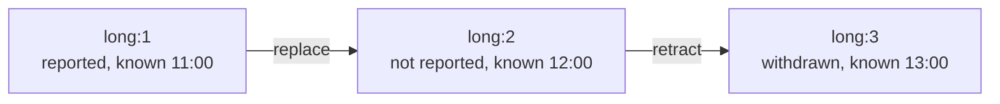

# Evidence and observations

The [semantic context](semantics.md) lists what could be true. Evidence is what sources reported.
OCBF stores two things separately:

- what a source *said*, kept exactly as received with its identifiers and times;
- what that report *means* in terms of assertions.

The three reports of the running example enter here, first as records and then as observations.

## Reports as evidence records

An **[evidence record](../reference/glossary.md)** stores one report: the producer's payload,
plus the identifiers and times needed to trace and correct it.

```python
from ocbf.evidence import EvidenceRecord

records: tuple[EvidenceRecord, ...] = tuple(
    EvidenceRecord(
        record_id=event,  # (1)!
        revision_id=f"{event}:1",  # (2)!
        source_id="fixture",  # (3)!
        producer_version="1",
        payload={"event": event, "reported": True},  # (4)!
        known_at=AT - timedelta(hours=1),  # (5)!
        provenance={"status": "synthetic"},
    )
    for event in TIMES
)
```

1.  Identifies the report. It stays the same when the report is corrected.
2.  Identifies this version of the report. A correction is stored as a new record with a new
    revision identifier, next to the original.
3.  The source that sent the report and the version of the software that produced its payload.
    Together they select which interpreter reads the payload (next section).
4.  The producer's own fields, stored as received. OCBF reads nothing from them until an
    interpreter does.
5.  The **[knowledge time](../reference/glossary.md)**: when this report became available to the
    assessment, 11:00. The time of the event itself is a different time, the validity time.

A record is never modified after it is created. Results list the revision identifiers they used,
such as `short:1`, which traces every number to the reports behind it.

## Interpreters give reports meaning

An **[interpreter](../reference/glossary.md)** reads a record and produces **observations**:
statements about assertions in the semantic context. Each interpreter has a name and a version,
and it is registered for one source and producer version. Every observation records which code
gave the record's payload its meaning.

```python
from dataclasses import dataclass

from ocbf.evidence.observations import Observation
from ocbf.sources.contracts import AdmissionIssue, EvidenceInterpreter


@dataclass(frozen=True)
class EndpointInterpreter:
    name: str = "synthetic-endpoint"  # (1)!
    version: str = "1"

    def interpret(
        self, record: EvidenceRecord, context: SemanticContext
    ) -> tuple[tuple[Observation, ...], tuple[AdmissionIssue, ...]]:
        event: str = record.payload["event"]
        observation: Observation = Observation(
            observation_id=record.record_id,
            source_id=record.source_id,
            family="endpoint",  # (2)!
            producer_version=record.producer_version,
            channel="conjunction",  # (3)!
            scope=(  # (4)!
                str(AssertionRef.event_exists(event)),
                str(AssertionRef.e2o(event, "subject", "op")),
            ),
            value=record.payload["reported"],
            evidence_ids=(record.revision_id,),  # (5)!
            interpretation=f"{self.name}@{self.version}",
            information_id=record.record_id,  # (6)!
            applicability={"expected": (True, True)},  # (7)!
        )
        return (observation,), ()  # (8)!


interpreters: dict[tuple[str, str], EvidenceInterpreter] = {
    ("fixture", "1"): EndpointInterpreter()  # (9)!
}
```

1.  The name and version are stored in every observation this interpreter produces, so results
    show which interpretation was used.
2.  The family groups observations of the same kind, here endpoint reports. The trust rules on the
    next page select observations by family.
3.  The **[observation channel](../reference/glossary.md)** says how a report depends on the truth
    of its scope; the next page gives it numbers. `conjunction` means one report about several
    assertions that are claimed to be true together.
4.  The assertions the report is about, built from its payload: the event both happened and
    belongs to `op`. The interpreter does not check that these assertions exist in the context;
    compilation does, on the [model page](model.md#what-compilation-checks).
5.  The revisions this observation was produced from.
6.  The **[information group](../reference/glossary.md)**. Copies of the same underlying report get
    the same value, so the model counts them once.
7.  The values the report claims for its scope, in order: both assertions are true.
8.  An interpreter returns observations and admission issues. This one produces one observation
    per record and never refuses a payload.
9.  The registry key is `(source_id, producer_version)`. A payload from any other producer version
    finds no interpreter.

The interpreter decides what a report means, and nothing else. Here a positive endpoint report is
one claim about two assertions together, not two separate votes, one for "happened" and one for
"belongs to `op`". The next page decides how much that claim counts.

## Prepared evidence

`prepare_evidence` keeps the revisions known at a cutoff time and runs the registered interpreters
on them:

```python
from ocbf.api import prepare_evidence
from ocbf.evidence.observations import InterpretedEvidence

evidence: InterpretedEvidence = prepare_evidence(
    records, as_of=AT, context=context, interpreters=interpreters  # (1)!
)
for observation in evidence.observations:
    print(observation.observation_id, observation.scope, observation.value)
print("issues:", evidence.issues)
```

1.  `as_of` is the knowledge cutoff: only revisions known by 12:00 are used.

Running the block prints:

```text
long ('event_exists(long)', 'e2o(long, subject, op)') True
short ('event_exists(short)', 'e2o(short, subject, op)') True
start ('event_exists(start)', 'e2o(start, subject, op)') True
issues: ()
```

`InterpretedEvidence` holds three things: the records in effect at the cutoff (`snapshot`), the
observations produced from them (`observations`), and any admission issues (`issues`). The reports
now have a meaning, but nothing is decided about what is true. Both positive end reports are kept,
even though at most one end can belong to `op`.

## Admission issues

When no interpreter can read a record, OCBF stores an **admission issue** instead of guessing a
meaning:

```python
from dataclasses import replace

unknown_version: EvidenceRecord = replace(records[1], producer_version="2")  # (1)!
unadmitted: InterpretedEvidence = prepare_evidence(
    (unknown_version,), as_of=AT, context=context, interpreters=interpreters
)
print(len(unadmitted.observations), unadmitted.issues)
```

1.  The same payload, but produced by software version 2, for which no interpreter is registered.

Running the block prints:

```text
0 (AdmissionIssue(key='short:1', status='uninterpreted', reason='no versioned interpreter'),)
```

Version 2 of the producer might use the same fields differently, so the record produces no
observation. The issue stays in `issues`, where your application can show it or fix its cause,
for example by registering an interpreter for version 2.

## Revisions and knowledge time

Reports get corrected. A correction is a new revision that names the revision it replaces. A
retraction withdraws a report entirely:

<div class="diagram-scroll" markdown tabindex="0" role="region" aria-label="Revision chain of the long end report; scroll horizontally to read all nodes">



</div>

The knowledge cutoff decides which revisions an assessment can see:

```python
from ocbf.evidence import EvidenceAction

correction: EvidenceRecord = replace(
    records[2],
    revision_id="long:2",
    previous_revision="long:1",  # (1)!
    action=EvidenceAction.REPLACE,
    payload={"event": "long", "reported": False},
    known_at=AT,
)
retraction: EvidenceRecord = replace(
    correction,
    revision_id="long:3",
    previous_revision="long:2",
    action=EvidenceAction.RETRACT,  # (2)!
    known_at=AT + timedelta(hours=1),
)
histories: dict[str, tuple[tuple[EvidenceRecord, ...], datetime]] = {
    "before the correction": ((*records, correction), AT - timedelta(minutes=1)),  # (3)!
    "correction": ((*records, correction), AT),
    "retraction": ((*records, correction, retraction), AT + timedelta(hours=1)),
    "retransmission": ((*records, records[1]), AT),  # (4)!
}
for label, (history, cutoff) in histories.items():
    revised: InterpretedEvidence = prepare_evidence(
        history, as_of=cutoff, context=context, interpreters=interpreters
    )
    effective: dict[str, object] = {
        observation.observation_id: observation.value for observation in revised.observations
    }
    print(f"{label}: {effective} {[issue.status for issue in revised.issues]}")
```

1.  Each new revision names the revision it replaces. The order in which records arrive never
    decides which revision counts.
2.  A retraction withdraws the report. It does not bring back `long:1`.
3.  The correction became known at 12:00, so an assessment as of 11:59 cannot see it.
4.  The same revision sent a second time.

Running the block prints:

```text
before the correction: {'long': True, 'short': True, 'start': True} ['out_of_scope']
correction: {'long': False, 'short': True, 'start': True} ['superseded']
retraction: {'short': True, 'start': True} ['superseded', 'superseded', 'retracted']
retransmission: {'long': True, 'short': True, 'start': True} ['duplicate']
```

The same records give different evidence at different cutoffs:

- An assessment as of 11:59 uses the original positive report about `long`. An assessment as of
  12:00 uses the negative correction. Both are valid questions about the same 11:00 event.
- After the retraction, `long` has no report at all. It is not reported negative, and the original
  positive report does not return.
- A second copy of a revision adds no observation.

Every revision left out is listed as an issue with its reason: `out_of_scope`, `superseded`,
`retracted`, or `duplicate`.

## Shared information and silence

Two systems can deliver copies of the same underlying report. If both copies get the same
information group (the `information_id` above), the model counts that report once. Two different
reports can also be wrong for the same reason, for example two scanners sharing a faulty clock.
OCBF does not infer that from labels. The model has to contain it explicitly, as a factor that
connects both observations; factors are introduced on the [model page](model.md).

!!! note "A missing report is not a negative report"

    `correction` above is an explicit negative report. The absence of a report counts as evidence
    only when the source was known to be able to report and the model describes how it reports.
    Without that, a missing end report does not show that `op` never ended.

## Summary

- An `EvidenceRecord` stores what a source said, unchanged, with identifiers, a knowledge time,
  and provenance. Results cite the revisions they used, such as `short:1`.
- A versioned interpreter turns records into `Observation`s about assertions. A record that no
  interpreter can read becomes an admission issue.
- The knowledge cutoff and the chain of revisions decide which reports count. Every revision left
  out carries its reason: `out_of_scope`, `superseded`, `retracted`, or `duplicate`.

Next, [Parameters and trust](parameters.md) decides how much each observation should count. For
procedures, see [interpret evidence](../how-to/interpret-evidence.md) and
[revise evidence](../how-to/revise-evidence.md).
