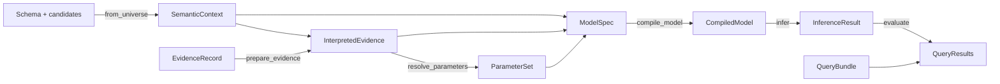

# Concepts

OCBF works out which histories of a process are plausible, given reports that may be incomplete,
conflicting, or wrong. A history here is **object-centric**: it says which events happened and
which objects, such as an Operation, each event belongs to. OCBF does not pick one history. It
gives each possible history a probability and answers questions about the process, such as "did
this Operation take too long?", from all of them.

These pages walk through the library with one small example. Each page explains one idea and
shows the Python objects behind it, and the example grows by one piece per page. Terms are
defined in the [glossary](../reference/glossary.md).

## The running example

An Operation `op` in a synthetic Job has one reported start and two reported ends. The two end
reports cannot both be right, and any report might be false.

| Time (UTC) | Report |
|---|---|
| 10:00 | `op` started (event `start`) |
| 10:15 | `op` ended (event `short`) |
| 11:00 | `op` ended (event `long`) |
| 12:00 | The assessment is made; nothing later is known |

The question is: did `op` take longer than a 30-minute reference? No single report settles it,
and each way of reading the reports is one kind of history:

- If `short` is the real end, `op` took 15 minutes.
- If `long` is, it took 60.
- If neither end belongs to `op`, it may still be running at 12:00.
- If the start report is false, the question may not apply at all.

The [first assessment](../getting-started/quickstart.md) runs this same example as one script,
`examples/fixed_parameters.py`. These pages build it step by step, so that you can see each part.

## How the pieces fit

Boxes are the Python objects, and arrow labels are the functions that create them. Read the pages
in this order:

1. [Semantic context](semantics.md): *what can be true?* The event and object types, the candidate
   events, and the true-or-false facts about them.
2. [Evidence and observations](evidence.md): *what was reported, and what does it mean?* Stored
   reports, the interpreters that read them, and corrections.
3. [Parameters and trust](parameters.md): *how much should a report count?* How reliably a source
   reports, stated through explicit rules.
4. [Models and constraints](model.md): *which histories are possible?* The rules and weights that
   connect the facts.
5. [Inference and posteriors](inference.md): *how plausible is each history?* Computing the
   probabilities, and what the result can answer.
6. [Queries and result meaning](queries.md): *what does that say about the question?* Stating the
   question and reading the answer.
7. [Revisions and execution](execution.md): *what happens when something changes?* Which changes
   need a new calculation, and how work is reused and kept.

OCBF does not fetch reports, store results, or decide which candidates exist; your application
does. See the [integration boundary](../how-to/integrate-application.md).

## Choose the question before the calculation

Separate probabilities for "`short` belongs to `op`" and "`long` belongs to `op`" cannot answer
the duration question, which needs the start and the end of `op` *in the same history*. OCBF
asks which combinations of facts a question needs before it computes anything;
[Inference and posteriors](inference.md#choose-the-question-first) shows how.

## Following the examples

!!! note "Run the blocks in order"

    The code on these pages forms one program. Each page reuses names defined on earlier pages,
    so run the blocks in order, starting from [Semantic context](semantics.md), in one Python
    session with OCBF installed. All reports, times, and trust values are synthetic.

The blocks use plain Python: dataclasses and `dataclasses.replace`, comprehensions,
`try`/`except`, and one `with` block, with NumPy only to seed a sampler. On the probability side
they use priors, marginals, and joint distributions, each defined on the page where it first
appears.

For step-by-step procedures, see the [how-to guides](../how-to/index.md). For complete rules and
supported combinations, see the [reference](../reference/index.md).
