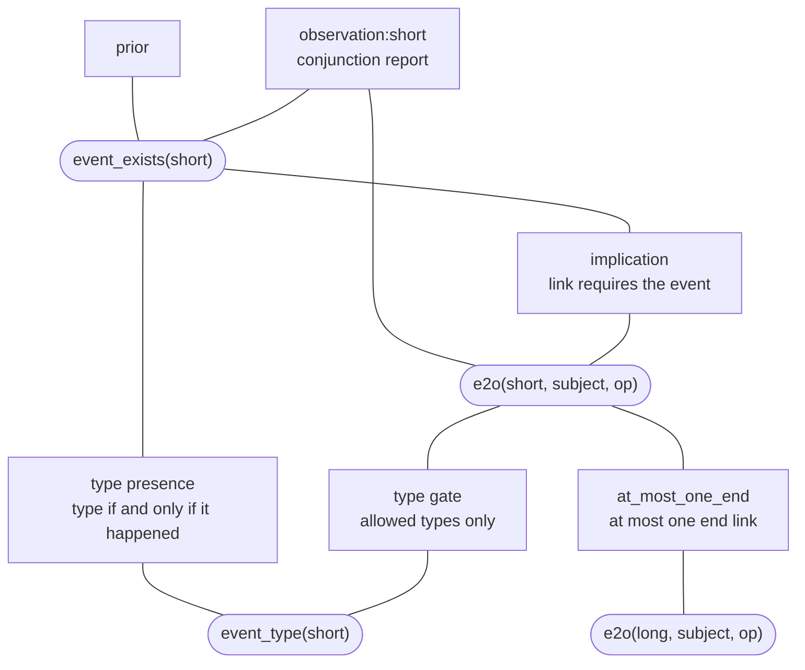

# Models and constraints

A **model** puts the inputs of the previous pages together. It lists the uncertain assertions
and the rules that connect them, and it says how strongly each observation favors each
combination of values. Compiling the model of the running example shows what OCBF adds to the
one factor you write yourself.

## Possible histories

A **history** is one complete combination of true and false values for all assertions. For the
duration question, the assertions that matter most are the three links to `op`:

| `start` linked | `short` linked | `long` linked | What the history means for `op` |
|---|---|---|---|
| yes | yes | no | Closed after 15 minutes |
| yes | no | yes | Closed after 60 minutes |
| yes | no | no | Started, with no end: still open at 12:00 |
| no | at most one end | at most one end | Start not linked: the duration question does not apply |
| either | yes | yes | Two ends for one Operation: impossible |

The reports make some rows more likely and others less likely; they never pick a single row. The
last row is impossible only because the model contains a rule against it. The next section adds
that rule.

## Model specification

A `ModelSpec` collects the context, the evidence, and the parameters, plus any **factors** you
add. A factor gives a weight to each combination of values of a few assertions. A rule gives
forbidden combinations a weight of zero. An observation gives more weight to the combinations its
report supports. The spec also contains the **decoding**, which turns a combination of values back
into events with times.

```python
from ocbf.api import compile_model
from ocbf.model.spec import CompiledModel, FactorSpec, ModelSpec

at_most_one_end: FactorSpec = FactorSpec(
    key="at_most_one_end",
    scope=(links["short"], links["long"]),  # (1)!
    family="count",  # (2)!
    parameters={"lo": 0, "hi": 1},
    role="support",  # (3)!
)
spec: ModelSpec = ModelSpec(
    context,
    evidence,
    parameters,
    factors=(at_most_one_end,),  # (4)!
    decoding={
        "kind": "identity finite assertions",
        "time_unit": "UTC seconds",
        "fixed_endpoints": TIMES,  # (5)!
    },
)
model: CompiledModel = compile_model(spec)

families: dict[tuple[str, str], int] = {}
for factor in model.factors:
    kind: tuple[str, str] = (factor.role, factor.family)
    families[kind] = families.get(kind, 0) + 1
for (role, family), count in sorted(families.items()):
    print(f"{role:<12} {family:<20} {count}")
print("variables:", len(model.variables))
```

1.  The factor involves only the two end links.
2.  A count factor limits how many assertions in its scope can be true, here between 0 and 1.
3.  `support` makes the rule absolute: any history that breaks it gets probability zero.
4.  The factors you add yourself. Compilation adds the others.
5.  Gives each candidate event its supplied time, so decoded histories have timestamps.

Running the block prints:

```text
descriptive  table                7
observation  conjunction_report   3
support      count                1
support      implication          3
support      type_gate            3
support      type_presence        3
variables: 10
```

The compiled model has 10 **variables**: the three links, whether each of the three events
happened, the type of each event, and the existence of `op`. Its 20 factors come in six kinds, and
only `at_most_one_end` was written by hand:

- `descriptive table` (7): the six priors from `priors`, plus a fixed prior for `op`, which is
  supplied as existing.
- `observation conjunction_report` (3): one per report. Each uses the resolved sensitivity and
  false-positive probability to weight the combinations of its two assertions.
- `support count` (1): `at_most_one_end`.
- `support implication` (3): an event can be linked to `op` only if it happened.
- `support type_gate` (3): an event can be linked through `subject` only if the relation allows its
  type.
- `support type_presence` (3): an event has a type if and only if it happened.

<div class="diagram-scroll" markdown tabindex="0" role="region" aria-label="Factor graph around the short end candidate; scroll horizontally to read all nodes">



</div>

Rounded nodes are variables and boxes are factors. The diagram shows only the factors around `short`;
the same pattern repeats for `start` and `long`. The compiled model does not depend on the engine
that will run it: every engine on the next page reads the same 20 factors.

## What compilation checks

Compilation checks that the inputs fit together before it computes any probability. It also
records where the inputs came from: the model's `manifest` stores the identifiers of the context,
the evidence, and the parameters. The report about `third`, which the
[semantic context](semantics.md#candidate-boundaries) never listed as a candidate, fails the check:

```python
print("context recorded:", model.manifest["context_id"] == context.context_id)

third_record: EvidenceRecord = replace(
    records[0],
    record_id="third",
    revision_id="third:1",
    payload={"event": "third", "reported": True},
)
third_evidence: InterpretedEvidence = prepare_evidence(
    (*records, third_record), as_of=AT, context=context, interpreters=interpreters
)
try:
    compile_model(replace(spec, evidence=third_evidence))
except ValidationError as error:
    print(type(error).__name__, str(error))
```

Running the block prints:

```text
context recorded: True
ValidationError third: observation outside candidate support
```

The interpreter produced an observation for `third`, because interpreters do not check candidates.
Compilation rejects it: `event_exists(third)` is not an assertion of this context, so no history
can make it true or false.

## Constraints and references

A rule about the process can play three different roles. Choosing the wrong role changes what the
question asks:

| Role | Where it lives | A history that breaks the rule is |
|---|---|---|
| **[Support](../reference/glossary.md)** | A `support` factor | Impossible: probability zero |
| Descriptive preference | A `descriptive` factor or a parameter | Possible, but less likely |
| **[Normative reference](../reference/glossary.md)** | The query, on the [queries page](queries.md) | Possible, and judged against the rule |

`at_most_one_end` is support: one Operation with two ends is impossible by definition. The
30-minute duration reference is normative. A 60-minute history stays possible, and the query
reports it as a violation. If the reference were written as support, the model would remove
exactly the histories the question asks about.

Support rules can also contradict each other. Compilation checks each input on its own; it does not
check whether at least one history satisfies all support rules together. Inference, the subject of
the next page, finds out:

```python
from ocbf.api import infer
from ocbf.errors import IncompatibleModel
from ocbf.inference.contracts import InferencePolicy

both_ends: FactorSpec = replace(
    at_most_one_end, key="both_ends", parameters={"lo": 2, "hi": 2}  # (1)!
)
contradictory: CompiledModel = compile_model(
    replace(spec, factors=(at_most_one_end, both_ends))
)
try:
    infer(contradictory, policy=InferencePolicy(engine="reference_elimination"))
except IncompatibleModel as error:
    print(type(error).__name__, str(error))
```

1.  Requires both end links to be true, which `at_most_one_end` forbids.

Running the block prints:

```text
IncompatibleModel joint hard support or likelihoods have zero mass
```

With no possible history left, OCBF raises `IncompatibleModel` instead of returning some other
distribution.

## Decoding

Decoding turns a combination of assertion values back into a history of `op`: which events
happened, which of them belong to `op`, and at what times. It keeps apart two cases that are easy
to confuse: an event that did not happen, and a value that is unknown. This history format is
internal to OCBF; it is not the OCEL file format.

!!! note "Compiling answers nothing yet"

    Compilation fixes which histories are possible and how each observation weighs them. The
    probabilities come from inference, on the next page.

## Summary

A history is one complete combination of values for all assertions; reports make histories more or
less likely and never pick one. `compile_model` checks that the context, the evidence, the
parameters, and your factors fit together, then adds the rest: for the running example, 10
variables and 20 factors, of which only `at_most_one_end` was written by hand. Support makes a
history impossible, a descriptive preference makes it less likely, and a normative reference
belongs to the query.

Next, [Inference and posteriors](inference.md) computes how likely each history is. For the
procedure, see [configure constraints](../how-to/configure-constraints.md).
