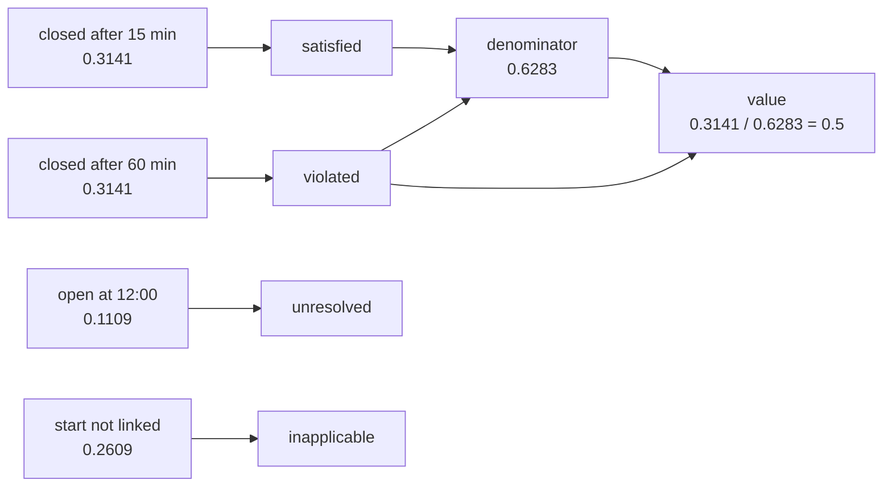

# Queries and result meaning

The [posterior](inference.md) gives each history a probability. A **query** turns those
probabilities into an answer to a question about the process. This page states the duration
question for `op`, evaluates it, and explains how to read the answer.

## Process projections

A history is a set of true and false assertions, but a duration question needs an **execution**:
one run of `op`, from a start event to an end event. A **projection** says how to read the
execution of `op` from any history: which candidate events can be its start, which can be its end,
and which assertions must be true for each one to count.

```python
from ocbf.queries import Endpoint, ExecutionProjection


def endpoint(event: str) -> Endpoint:
    return Endpoint(
        event_key=exists[event],  # (1)!
        time=TIMES[event],  # (2)!
        association=((links[event], True),),  # (3)!
    )


projection: ExecutionProjection = ExecutionProjection(
    execution_id="op",
    population_id="synthetic-job",  # (4)!
    starts=(endpoint("start"),),
    ends=(endpoint("short"), endpoint("long")),  # (5)!
)
```

1.  The assertion that must be true for this candidate to count: the event happened.
2.  The time of the event. It must match the time given to the model's decoding.
3.  Further assertions that must be true: the event belongs to `op`.
4.  The group of executions the question is about, here the synthetic Job. Counts are taken over
    this group.
5.  Both end candidates are listed. In each history at most one of them is linked to `op`, and the
    projection uses that one.

The projection does not choose the most likely end. In each history, it reads whichever end is
linked there: 15 minutes in some histories, 60 in others, and no end in others. The uncertainty
about the end therefore carries through to the answer. A candidate event can also appear in more
than one projection, for example as a possible end of two different Operations.

## Process questions

A **query specification** (`QuerySpec`) combines projections with a kind of question, a time
window, and a **[normative reference](../reference/glossary.md)**: the rule the executions are
judged against. A **bundle** (`QueryBundle`) groups questions that are evaluated on the same
posterior:

```python
from ocbf.api import requirements_for
from ocbf.queries import ConditionInterval, QueryBundle, QuerySpec

duration: QuerySpec = QuerySpec(
    name="duration",
    kind="duration_exception",  # (1)!
    executions=(projection,),
    window_start=AT - timedelta(days=1),  # (2)!
    horizon=AT,  # (3)!
    reference={  # (4)!
        "reference_id": "synthetic-reference-v1",
        "threshold_minutes": {"op": 30},
    },
)
bundle: QueryBundle = QueryBundle(
    (
        duration,
        replace(duration, name="count", kind="expected_exception_count"),  # (5)!
        replace(
            duration,
            name="tracking overlap",
            kind="exposure",  # (6)!
            coverage_verified=True,
            conditions=(
                ConditionInterval(
                    AT - timedelta(minutes=110),
                    AT - timedelta(minutes=100),
                    evidence_ids=("tracking-loss",),
                ),
            ),
        ),
    )
)
needed: QueryRequirements = requirements_for(bundle)
print(len(needed.scopes[0]), "assertions in one joint scope")
print("provided as one of:", needed.alternatives)
```

1.  The kind of question: did the execution take longer than the reference? The answer is a
    probability.
2.  An execution whose start lies before this time is outside the question.
3.  The latest time the question looks at. An execution with no end by then is still open.
4.  The reference, given per execution: 30 minutes for `op`. It belongs to the question, not to the
    model, so a 60-minute history stays possible and is judged a violation.
5.  The expected number of executions in the Job that take longer than the reference.
6.  How many minutes the execution overlaps a supplied time interval, here a period of lost
    tracking from 10:10 to 10:20. `coverage_verified=True` states that no such interval is missing
    from the list for this window.

Running the block prints:

```text
6 assertions in one joint scope
provided as one of: (('joint',), ('joint_draws',))
```

`requirements_for` works out what these questions need: the joint probabilities of all six start
and end assertions, either as a table (`joint`) or as sampled histories (`joint_draws`). The exact
result from the inference page was planned for only two of these assertions. Its engine can still
compute the joint of any assertions of this small model when asked, so no second inference run is
needed. Questions about a whole Job's conformance, and about ranking Jobs by priority, are shown in
[use joint inference](../how-to/joint-inference.md).

## Reading an estimate

`evaluate` answers every question in the bundle. Each answer is an **estimate**:

```python
from ocbf.api import evaluate
from ocbf.belief.estimates import Estimate, QueryResults

answers: QueryResults = evaluate(result, bundle)
estimate: Estimate = answers.estimates[0]
print("value:", estimate.value, estimate.unit)
print("denominator:", round(estimate.denominator, 4))
print("status:", estimate.status, "| computation:", estimate.computation)
for qualification in estimate.qualifications:
    print("-", qualification)
```

Running the block prints:

```text
value: 0.5 probability
denominator: 0.6283
status: assessed | computation: exact-on-finite-model
- Conditional on declared candidate support, time model and evidence coverage.
- Missing endpoints and unresolved associations are not zero durations.
- Configured reference is a query input, not an observed production standard.
```

Each field answers a different part of "what does 0.5 mean?":

- `value` is the probability that `op` took longer than 30 minutes, counting **only the histories
  in which that can be decided**.
- `denominator` is the total probability of those histories, 0.6283. The value is a share of it.
- `status` is `assessed` when a value was computed. Other statuses mark answers that could not be
  computed.
- `computation` is the kind of number, taken over from the inference result.
- `qualifications` are the conditions under which the number holds.

## Evaluability and missing values

`outcomes` shows how the probability of all histories splits up for this question:

```python
for outcome, probability in estimate.outcomes.items():
    print(f"{outcome:<12} {probability:.4f}")
```

Running the block prints:

```text
inapplicable 0.2609
pending      0.0000
satisfied    0.3141
unresolved   0.1109
violated     0.3141
```

<div class="diagram-scroll" markdown tabindex="0" role="region" aria-label="History classes and their query outcomes; scroll horizontally to read all nodes">



</div>

Each history class from the [inference page](inference.md#how-plausible-each-history-is) gets
exactly one outcome:

- **Closed after 15 minutes** is within the reference: *satisfied*.
- **Closed after 60 minutes** exceeds it: *violated*.
- **Open at 12:00** started 120 minutes before the horizon, which is already past 30 minutes, but
  no end is linked to `op`. The duration is *unresolved*: it is neither zero nor within the
  reference.
- **Start not linked** has no start for `op`, so the question is *inapplicable*.
- *Pending* would be an open execution that is still within 30 minutes at the horizon. No history
  here is pending.

Only satisfied and violated histories enter the value. The denominator is their sum,
0.3141 + 0.3141 = 0.6283, and the value is 0.3141 / 0.6283 = 0.5. The remaining 37% of the
probability is not counted as satisfied; it stays visible under `outcomes`. The
[result reference](../reference/results.md#query-estimates) gives the complete rules.

!!! note "Keep in mind"

    Read the denominator before the value. A value of 0.5 over a denominator of 0.6283 means: among
    the histories in which the question can be decided, half exceed 30 minutes. It does not mean
    that `op` exceeded 30 minutes with probability 0.5; that probability is 0.3141.

## Different sources of uncertainty

The 0.5 is uncertain in more than one way. Each kind has a different cause and a different remedy.
First, the sampled result from the inference page gives a slightly different value:

```python
sampled_estimate: Estimate = evaluate(sampled, bundle).estimates[0]
mcse: float = sampled_estimate.numerical["mcse"]
print(f"exact:   {estimate.value:.3f}")
print(f"sampled: {sampled_estimate.value:.3f} (MCSE {mcse:.3f})")
```

Running the block prints:

```text
exact:   0.500
sampled: 0.494 (MCSE 0.015)
```

Second, the cautious trust values from the parameters page give a different answer:

```python
from ocbf.api import SensitivityResult, compare_settings

comparison: SensitivityResult = compare_settings(
    spec, bundle, {"nominal": parameters, "cautious": cautious}, policy=policy  # (1)!
)
for name, _, setting_answers in comparison.settings:
    setting_estimate: Estimate = setting_answers.estimates[0]
    print(
        f"{name:<9} value {setting_estimate.value:.4f},",
        f"denominator {setting_estimate.denominator:.4f}",
    )
print(comparison.meaning)
```

1.  Runs the whole calculation once for each named parameter set: compile, infer, and evaluate.

Running the block prints:

```text
cautious  value 0.5000, denominator 0.3130
nominal   value 0.5000, denominator 0.6283
named manual-assumption sensitivity; no mixture weights implied
```

With the weaker cautious reports, more probability goes to histories in which the question cannot
be decided, so the denominator halves. The two ends still split what remains evenly, so the value
stays 0.5.

| Kind of uncertainty | In this example | What reduces it |
|---|---|---|
| Posterior uncertainty | `short` and `long` are both plausible ends | More or better evidence |
| Monte Carlo error | The sampled value 0.494 has an MCSE of 0.015 | More draws, or an exact engine |
| Assumption sensitivity | Cautious trust halves the denominator | Better knowledge of how reliable the source is |
| Evidence limitation | Nobody has checked that the producer's event identifiers are correct | Checking the source; no calculation can fix it |

More draws reduce only Monte Carlo error. They cannot tell you which trust values are right, or
whether a producer's identifiers are correct.

## Lineage and exposure

The third estimate is the overlap with the tracking-loss interval:

```python
overlap: Estimate = answers.estimates[2]
print(overlap.value, overlap.unit)
print(overlap.evidence_ids)
```

Running the block prints:

```text
7.5 minutes
('long:1', 'short:1', 'start:1', 'tracking-loss')
```

**[Exposure](../reference/glossary.md)** is the overlap between the execution and the supplied
interval, averaged over the histories in which the execution can be evaluated. The interval runs
from 10:10 to 10:20:

- In the 15-minute history, `op` runs from 10:00 to 10:15 and overlaps the interval for 5 minutes.
- In the 60-minute history, it overlaps the whole 10 minutes.

The two histories are equally likely, so the exposure is 7.5 minutes.

`evidence_ids` lists every input the estimate used: the three report revisions and the interval.
It is a list of inputs, not a measure of how much each input caused the result. In the same way,
7.5 minutes of overlap with lost tracking does not mean that the tracking loss delayed `op` by 7.5
minutes.

## Summary

- An `ExecutionProjection` reads the execution of `op` from every history and keeps all start and
  end alternatives.
- A `QuerySpec` states the question, its time window, and its reference. `evaluate` returns an
  `Estimate` with a value, a denominator, and the probability of each outcome.
- Read the denominator and the outcomes before the value. Keep posterior uncertainty, Monte Carlo
  error, assumption sensitivity, and evidence limitations apart.

Next, [Revisions and execution](execution.md) shows what happens when the inputs or the question
change. For procedures, see [evaluate queries](../how-to/evaluate-queries.md) and
[read diagnostics](../how-to/read-diagnostics.md); the [result reference](../reference/results.md)
defines every field.
