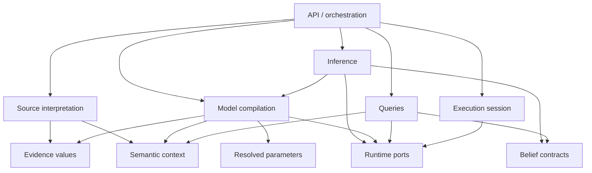

# Architecture

OCBF is one modular synchronous Python library. Its facade composes independent operations;
the calling application owns storage, ingestion, scheduling, and presentation.

## Responsibility map

| Area | Owns | Boundary |
|---|---|---|
| Schema, assertions, universe | Fixed semantics, candidate support, stable references, immutable context | No source parsing or solver selection. |
| Evidence | Envelopes, revisions, effective snapshots, admission values | No likelihood interpretation by default. |
| Sources | Interpreter contract and explicit registry execution | Producer meaning stays outside generic queries. |
| Reliability | Resolved manual parameter values and separate numerical utilities | Canonical inference performs no fitting. |
| Model | Canonical specification, compilation, factors, reductions, decoding, dependencies | Consumes observations, not external rows. |
| Inference | Planning, adapters, elimination, conditionals, sampling, warm starts | Computes a declared target and capabilities. |
| Belief | Neutral posterior/result contracts and numerical marginal views | Does not initiate computation. |
| Queries | Projection, interval/status primitives, aggregation, qualified estimates | Consumes capabilities; no hidden inference. |
| Runtime | Store/control ports, execution assessments, bounded session implementation | Lower layers receive ports, not a concrete session. |
| I/O | Allowlisted neutral bundles and validated array artifacts | No executable extension or native workspace serialization. |
| API | Composition, named trust comparisons, lifecycle coordination | Keeps scientific logic with its owning subsystem. |

In dependency terms, the API orchestrates source interpretation, model compilation,
inference, queries, and the execution session. Source interpretation and model compilation
build on the semantic context and evidence, and compilation also consumes resolved
parameters. Inference consumes the compiled model and produces the belief contracts that
queries read. Inference, model compilation, queries, and the session all reach the runtime
ports rather than a concrete session.

Arrows describe major dependency direction rather than every Python import. Package
initializers also expose numerical utilities; those re-exports must not introduce optional
native libraries into contract imports. Serializer composition is a boundary that explicitly
knows the allowlisted value implementations.

## Public composition

The facade exposes evidence preparation, compilation, planning, inference, evaluation,
named settings comparison, and result-retention helpers. Advanced callers can invoke
the owning lower-level modules independently.

Registries are supplied locally. Contract modules are separate from concrete implementations:
source protocols, model factor/channel protocols, inference requests, belief capabilities,
query protocols, and runtime ports do not need import-time plugin registration.

## Numerical and application boundaries

Discrete graphs, Gaussian banks, copula transforms, marginal views, static-source
diagnostics, baselines, and synthetic generators are supporting numerical utilities.
Their contracts are narrower than canonical process inference.

Generic example study/replay/report helpers live in shared example support. Mammut
archive access, RTLS interpretation, and historical bindings remain in that integration.
The synthetic joint example has no dependency on Mammut parsing or external data.

## Change discipline

A new channel should not require edits to query logic. A new engine should satisfy the
same declared belief capabilities. A changed normative reference should reuse an adequate
posterior; changed evidence or scientific assumptions produce a new target.

Preserve mathematical constants, support, units, and scientific identity when optimizing
representations. Use [validation seams](validation.md) to demonstrate that preservation.
