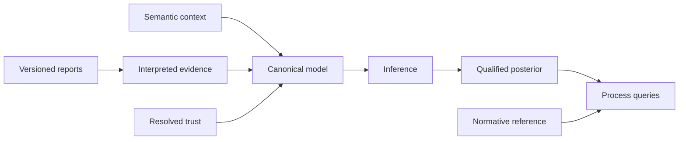

---
hide:
  - toc
---

# Reason about uncertain process histories

OCBF combines interpreted reports under an explicit probability model, then answers
questions about the resulting object-centric histories. You supply the semantic context,
candidate support, source meaning, and manual trust.

Take the [workflow tour](overview/workflow.md) to see the inputs, handoffs, and results.

[Run your first assessment](getting-started/quickstart.md){ .md-button .md-button--primary }
[Explore capabilities](reference/capabilities.md){ .md-button }

## What OCBF is, in plain terms

OCBF takes possibly-conflicting reports about what happened in a process, weighs how much
to trust each source, and answers questions about what most likely happened — while keeping
the uncertainty explicit instead of guessing a single history.

It is for people integrating process or event data who need calibrated, auditable answers
rather than one silently-chosen story. Familiarity with event and process data and basic
probability is enough to follow along. Unfamiliar with a term? The
[glossary](reference/glossary.md) defines the vocabulary used throughout.

You call it from your own code; it is not a data pipeline, user interface, or scheduler.
Those responsibilities stay in [your application](overview/workflow.md).

- **Start with a working example**

    Install the library and follow a complete synthetic evidence-to-query calculation.

    [Getting started →](getting-started/index.md)

- **Apply it to your question**

    Interpret reports, configure trust, choose inference, and inspect qualified results.

    [How-to guides →](how-to/index.md)

- **Understand the model**

    See how fixed semantics, evidence revisions, joint uncertainty, and computation fit together.

    [Concepts →](concepts/index.md)

- **Build on the contracts**

    Inspect the current architecture and add interpreters, channels, engines, or evaluators.

    [Development →](development/index.md)

## One model, explicit handoffs

OCBF is an in-process library. Database access, ingestion, credentials, scheduling, and
screens belong to the calling application. Its [integration boundary](integrations/index.md)
keeps producer-specific fields out of generic process queries.

## Understand the answer you receive

Results retain their scope, denominators, scientific identities, evidence qualifications,
and numerical assessment. A probability is conditional on the supplied model and evidence.
An unavailable quantity remains explicit.

See [capabilities and limitations](reference/capabilities.md) and
[result meanings](reference/results.md) before using an estimate in a decision.
