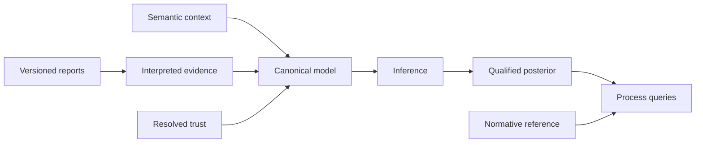

---
hide:
  - toc
---

# Reason about uncertain process histories

OCBF takes possibly-conflicting reports about what happened in a process, weighs how much
to trust each source, and answers questions about what most likely happened — while keeping
the uncertainty explicit instead of guessing a single history. You call it from your own
code; it is not a data pipeline, user interface, or scheduler.

[Run your first assessment](getting-started/quickstart.md){ .md-button .md-button--primary }
[Explore capabilities](reference/capabilities.md){ .md-button }

## Try it

Python 3.12 or later is required. From a clone of the repository, with an activated
environment (see [installation](getting-started/installation.md)):

```bash
python -m pip install -e .
python -m examples.fixed_parameters
```

The example uses synthetic reports and the core finite reference engine.

## Find your way

<div class="grid cards" markdown>

- **Getting started**

    Learn by doing: install the library and follow a complete synthetic assessment.

    [Getting started →](getting-started/index.md)

- **Concepts**

    Understand the workflow, the library objects, and why results carry qualifications.

    [Concepts →](concepts/index.md)

- **How-to guides**

    Solve one task: interpret reports, choose inference, bound execution, or integrate.

    [How-to guides →](how-to/index.md)

- **Reference**

    Look up capabilities, configuration, result fields, the glossary, and the API.

    [Reference →](reference/index.md)

- **Development**

    Contribute: architecture, validation, and documentation maintenance.

    [Development →](development/index.md)

</div>

## One model, explicit handoffs

<div class="diagram-scroll" markdown tabindex="0" role="region" aria-label="Evidence to query workflow; scroll horizontally to read all nodes">



</div>

Database access, ingestion, credentials, scheduling, and screens belong to the calling
application; see the [integration boundary](how-to/integrate-application.md).

## Understand the answer you receive

Results retain their scope, denominators, scientific identities, evidence qualifications,
and numerical assessment. A probability is conditional on the supplied model and evidence.
An unavailable quantity remains explicit.

See [capabilities and limitations](reference/capabilities.md) and
[result meanings](reference/results.md) before using an estimate in a decision.
