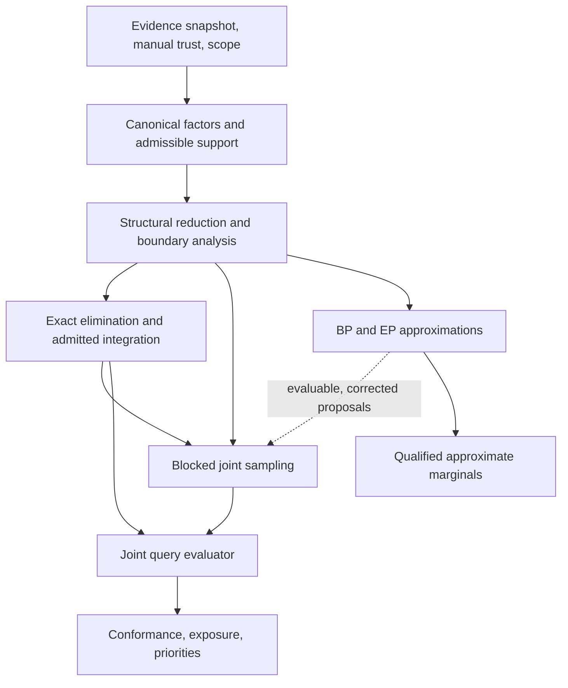

# Proposal for the OCBF inference architecture and algorithms

**Use a query-oriented hybrid system: exact elimination where tractable, blocked joint sampling for the remaining uncertainty, and BP/EP as explicitly approximate inference and proposal guidance.** Keep manual trust and evidence interpretation separate from the numerical engine. Evaluate related business questions against the same model and joint belief.

This proposal applies the [inference research synthesis](ocbf-inference-synthesis.md) to the [OCBF grounding proposal](ocbf-grounding-proposal.md). It specifies conceptual responsibilities, mathematical contracts, and algorithm choices. It is not an implementation plan, and the recommended performance has not been demonstrated on the factory data.

## 1. Architectural objective

The system should answer questions about uncertain Job/Operation histories while preserving the fixed semantic skeleton. Its default emphasis is retrospective exception assessment, conformance, descriptive exposure, and priority sensitivity under manually configured trust.

The central target remains

$$
\pi_{\kappa,\theta}(x)
=Z_{\kappa,\theta}^{-1}
\mathbf 1_{\Omega_{\mathcal S,\mathcal U_\kappa}}(x)
\prod_{f\in F_\kappa}\psi_{f,\theta}(x_f),
\qquad L=\mathcal D(x).
\tag{A1}
$$

$x$ includes history variables and necessary observation/association latents; $\mathcal D$ recovers the OCEL-like history. The model configuration $\theta$ includes priors, likelihood parameters, dependence assumptions, and any temporal model. Knowledge time $\kappa$ identifies the evidence state.

All engines must address this target or declare the precise approximation. A successful numerical calculation cannot compensate for incorrect source applicability, duplicated upstream evidence, or inadequate candidate support.

## 2. Logical components

The arrows describe mathematical information flow, not separate services or deployment units.

| Component | Responsibility | Required output |
|---|---|---|
| Model/evidence coordinator | Select one evidence state, candidate universe, trust configuration, and query/reference scope. | A reproducible model identity and declared conditioning assumptions. |
| Semantic factor construction | Translate applicable observations and constraints into the target measure. | Factor scopes, hard support, likelihoods, provenance groups, and scale information. |
| Structural analysis | Remove deterministic redundancy, identify connected uncertainty and separators, estimate computation cost. | A decomposition that preserves the target or labels its boundary approximation. |
| Exact computation | Sum/integrate tractable subproblems. | Boundary factors, relevant normalizing constants, and conditional representations as required by the outer algorithm. |
| Joint sampling | Explore remaining ambiguity with valid coordinated moves. | Coherent draws or weighted samples, plus query-relevant diagnostics. |
| Approximate inference | Supply fast marginal estimates and useful proposal information. | Approximation identity, residuals, and evaluable proposal densities when used for correction. |
| Query evaluation | Compute process quantities on the same histories or joint conditionals. | Consistent expectations, probabilities, distributions, and qualified sensitivity results. |

This separation supports future algorithm substitution without redefining what an Operation, event, qualified link, or conformance predicate means. See the synthesis's [target](ocbf-inference-synthesis.md#i1) and [decomposition](ocbf-inference-synthesis.md#i3).

## 3. Canonical model requirements

The admissible support must represent definitional constraints explicitly. Wrong-type relations, impossible existence/link combinations, and genuine same-Operation restrictions cannot be converted into arbitrary finite penalties merely for numerical convenience. Normative expectations remain separate from descriptive reconstruction.

Deterministic structure should use a compact encoding. For example, a genuinely exactly-one association can be one categorical variable whose values decode to qualified E2O links. Multiple participation and unresolved alternatives must remain representable when allowed. This is a computational encoding of the fixed semantics, not an ontology change.

Every observation contributes through its justified likelihood and dependence structure. Copies and derived descendants must not be counted as independent evidence. Uninterpreted/default fields remain outside observational likelihoods.

Factor scales must be preserved when they affect comparisons across hypotheses. A constant independent of all inferred variables can cancel from one normalized posterior; a mode-dependent Gaussian normalizer or a different rescaling for each conditioned problem cannot be dropped without accounting for it.

The model must also distinguish invalid normalization from uncertainty. If its evidence normalizer is zero or undefined, the result is an explicit model/evidence incompatibility, not a uniform posterior.

## 4. Default inference algorithm

### 4.1 Prefer bounded exact computation

**Algorithm A — inference for one evidence snapshot and query scope**

1. Establish the model identity, applicable factors, admissible support, query definitions, and reference.
2. Reduce clamped and deterministic structure without changing probability mass.
3. Identify the region relevant to the queries and the boundary information required from outside it.
4. Estimate discrete elimination cost and check whether continuous factors admit the proposed integration method.
5. If tractable, eliminate irrelevant variables and retain the joint information needed by the queries.
6. Otherwise, condition on a selected ambiguity set and apply the joint algorithm below, eliminating only tractable remainders.
7. Evaluate related queries from that common result and attach the computation and model qualifications.

The feasibility decision depends on induced scopes, variable cardinalities, mixture growth, and integration families. No fixed raw-message threshold or arbitrary number of Jobs is prescribed.

Exact discrete elimination should be the preferred route for small or low-width posterior regions. The existing GTSAM wrapper is an asset, but its current marginal/MPE result is not yet the required general joint conditional and normalizer contract.

When a region is genuinely conditional Gaussian, use analytical elimination with all normalizers. For low-dimensional non-Gaussian time factors, controlled numerical integration is an option with an explicit numerical qualification. High-dimensional truncation or nonlinear likelihoods should not be silently replaced by independent Gaussian marginals. See [exact and hybrid inference](ocbf-inference-synthesis.md#i4).

### 4.2 Preserve regional boundaries

A Job-centered question may depend on other Jobs through Stations, source modes, or uncertain assignments. Either include the relevant dependencies or retain their joint separator message.

A cohort-only model that deliberately excludes exterior evidence can still be meaningful. It is then conditional on that scope choice. It should not be described as the full-factory posterior restricted to the cohort.

Comparisons across Jobs must preserve shared uncertainties. Independently sampling a common source mode for each Job changes the ranking distribution.

## 5. Preferred joint sampling algorithm

Let $c$ collect the ambiguity variables to be sampled and $v$ a tractable remainder:

$$
g(c)=\int\gamma(c,v)\,d\mu(v),
\qquad
\pi(c)=\frac{g(c)}{\int g(c')\,d\mu(c')}.
\tag{A2}
$$

The sampled state can include difficult continuous variables; it need not be only discrete. Exact integration is used only where justified.

**Algorithm B — blocked Rao–Blackwellized sampling**

1. Construct admissible initial states representing materially different episode or association alternatives.
2. Choose blocks that can move between feasible configurations: an association with its dependent links, an occurrence with its applicable fields, or coupled times when needed.
3. Use exact block conditionals where feasible; otherwise generate a proposal with a known density.
4. Evaluate the original target ratio, using analytically eliminated quantities where available.
5. Accept or reject with the correct MH rule, retaining the current state on rejection.
6. Estimate queries using conditional expectations for eliminated quantities, or draw those quantities jointly when the query requires them.
7. Assess mixing, mode coverage, and numerical precision for the actual reported queries.

For proposal density $r(c'\mid c)$, the acceptance probability is

$$
a(c,c')
=\min\left\{1,
\frac{g(c')\,r(c\mid c')}
{g(c)\,r(c'\mid c)}
\right\}.
\tag{A3}
$$

The required argument is that the kernel preserves the target and explores its relevant support. A single-site sampler can be unable to move under exactly-one or other hard constraints. Local moves alone may also fail to connect different reconstruction modes.

Where inner integration is difficult, prefer keeping those variables in the sampled state over treating an uncontrolled approximate integral as exact. A pseudo-marginal construction is a possible specialized alternative, with its own unbiased-estimator and extended-state requirements.

BP/EP can guide proposals, but sampling, rejection, or repair must yield an evaluable proposal density for correction. Independently drawing approximate marginals and repairing the result is not a generic posterior sampler.

Blocked sampling is the preferred fallback because it fits retrospective, irregularly connected evidence without requiring a physical transition model. Static SMC is a strong alternative when sequential factor assembly or multimodality makes a particle population more effective. No performance winner between them is claimed without comparison. See [joint Monte Carlo](ocbf-inference-synthesis.md#i6).

## 6. Role of BP, EP, and advanced methods

BP should remain available for fast approximate assertion screening and inference diagnostics on larger regions. Generalized BP may improve local dependency representation. EP is useful for admitted continuous approximations.

These outputs carry their own approximation status. A converged BP/EP result is not automatically an accurate joint history distribution. An exact Gaussian calculation against an approximate cavity is still conditional on that approximation.

The following are specializations rather than prerequisites:

| Specialization | When its assumptions become useful |
|---|---|
| Static/tempered SMC | Multiple competing modes or a useful sequential decomposition of one retrospective target. |
| Particle filtering and smoothing | A justified physical transition model and prospective or temporal-state queries. |
| Incremental elimination / multi-hypothesis smoothing | Repeated evidence changes whose affected factor structure can be reused correctly. |
| Weighted model counting/integration or circuits | Repeated predicates and stable grounded structures that admit tractable compilation. |
| Learned proposals or flows | Repeated comparable problems with adequate training coverage and evaluable correction where needed. |
| GPU/vectorized inference | A supported computation whose numerical cost, rather than modeling ambiguity, is the limiting factor. |

The recommended foundation does not require automatic reliability learning, a universal CTBN, a learned joint model, or a replacement inference library. The synthesis evaluates the [message-passing](ocbf-inference-synthesis.md#i5), [temporal](ocbf-inference-synthesis.md#i7), and [compiled/learned](ocbf-inference-synthesis.md#i8) alternatives.

## 7. Query and result contract

For coherent draws or weighted histories, evaluate

$$
\widehat{\mathbb E}[q(L)]
=\sum_{s=1}^{S}\bar w_s q(L^{(s)}),
\qquad
\sum_s\bar w_s=1.
\tag{A4}
$$

Use equal weights only for an appropriate posterior sampling construction. Conditional expectations can replace additional draws. Related conformance, gap, exposure, and ranking queries share the same posterior representation.

Each answer should identify:

- the target population, factory interval, knowledge cutoff, and reference;
- candidate support, unresolved associations, and observation coverage;
- the trust/dependence configuration and any separate sensitivity settings;
- the estimated quantity and units;
- the computational method, numerical qualification, and relevant diagnostics;
- the provenance and interpretation versions needed to reproduce it.

The computation status should distinguish exact-on-declared-model, numerically integrated, Monte Carlo estimated, variational/message-passing approximation, scenario-only, and unresolved. These labels do not replace the separate statement of model scope and data provenance.

MAP configurations and selected coherent scenarios remain useful explanations. They are not posterior probabilities unless their weighting and omitted mass justify that interpretation. Conformance checks should retain pending/inapplicable cases; descriptive overlap should retain unknown coverage and should not be reported as causal loss.

See [joint query semantics](ocbf-inference-synthesis.md#i9) and [diagnostics](ocbf-inference-synthesis.md#i11).

## 8. Revisions and trust sensitivity

The default evidence-update semantics is a new posterior calculation for a new evidence snapshot. Reuse valid factorization and messages where their dependencies permit it; treat warm starts as computational aids.

Retractions and corrected associations can expand support. Old samples cannot be reweighted into newly possible states that they never represented. Even with unchanged support, importance reweighting requires adequate overlap and diagnostics. Recomputing affected bounded regions is therefore the preferred initial architectural contract.

Manual trust settings remain fixed during a conditional inference run. A finite set of alternative settings gives a sensitivity analysis. A reliability posterior, if later desired, requires an explicit probabilistic treatment and consistent sharing across all affected Jobs.

Every returned belief and parameter set must refer to the same model/evidence epoch. An alternating fit-and-infer procedure must not expose the final fitted parameters as though an earlier belief result were already conditioned on them.

Source-removal explanations require a defined deletion experiment, including dependent descendants. Message attribution alone does not provide removal effects or causal attribution. See [revision and sensitivity](ocbf-inference-synthesis.md#i10).

## 9. Scientific acceptance of the architecture

The architecture is supported in principle when exact and approximate engines operate on the same target; decoded histories respect its support; repeated evidence does not add independent weight; and related queries remain consistent projections of one belief.

Its numerical adequacy must be assessed on the actual questions. Marginal accuracy alone is insufficient for rankings and temporal overlap. Sampling diagnostics must concern query indicators, durations, and reconstruction modes; a generic residual or ESS is not a universal confidence score.

Its empirical adequacy is a separate question requiring defensible physical evidence and reference provenance. The dated factory findings support the modeling constraints, but do not constitute a calibrated benchmark for this architecture.

The recommended emphasis is therefore bounded retrospective inference that produces useful, qualified business conclusions, with exact computation used as an operational option and blocked joint sampling as the principled generalization. The [comparative synthesis](ocbf-inference-synthesis.md#i12) and [open questions](ocbf-inference-synthesis.md#i13) state the remaining limits.
