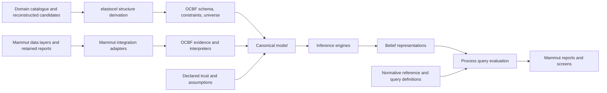
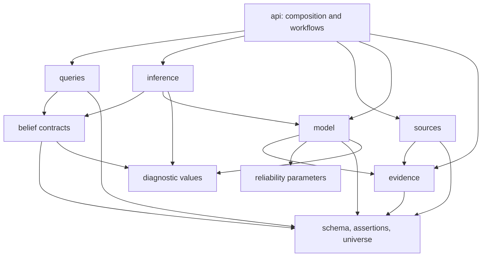
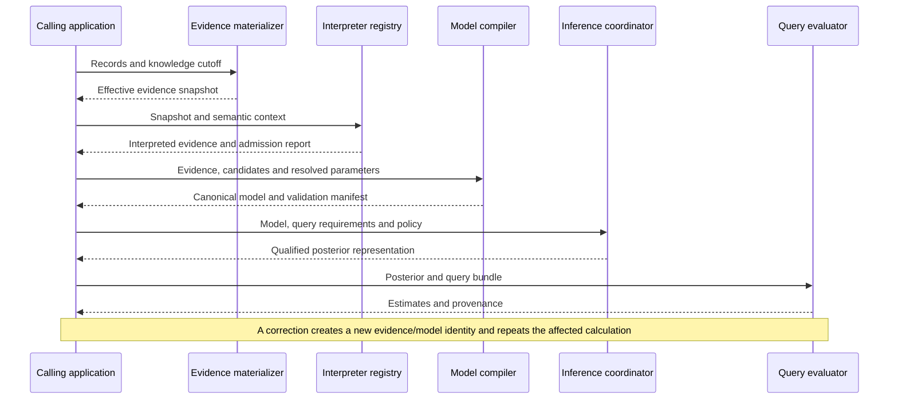

# OCBF software architecture

**Status:** Proposed library architecture; implementation is not implied.  
**Date:** 11 September 2026.  
**Source baseline:** OCBF commit `1bb372b0fb6869fe27adda434336dca729a622f0`, inspected locally.  
**Scope:** Module design, interfaces, runtime responsibilities, extension contracts, and architectural validation. No delivery schedule or implementation accompanies this document.

## Recommendation

**Evolve OCBF as one modular Python library with a canonical probabilistic model, interchangeable inference engines, and a common query/result layer.** Preserve its existing schema, assertion, source, and numerical assets. Add the missing evidence lifecycle and joint-belief contracts around them.

The central separation is between **what a report means**, **what probability model follows from that interpretation**, **how that model is computed**, and **what business question is asked of the resulting belief**. An upstream field change should normally affect its interpreter, while conformance and exposure queries continue to operate on the same object-centric concepts.

The initial architectural emphasis is bounded retrospective Job/Operation assessment with explicit manual trust. Exact elimination serves tractable regions; blocked joint sampling handles remaining ambiguity; BP/EP remain useful approximate engines. This follows the [inference proposal](ocbf-inference-proposal.md) and its [research synthesis](ocbf-inference-synthesis.md), under the semantics of the [grounding proposal](ocbf-grounding-proposal.md) and [grounding synthesis](ocbf-grounding-synthesis.md).

The package structure below is a proposed destination, not a description of features already implemented. The [compatibility assessment](#a13) distinguishes the two.

## Contents

1. [Architectural drivers and boundaries](#a1)
2. [System context and design patterns](#a2)
3. [Package structure and dependency rules](#a3)
4. [Core data contracts and identity](#a4)
5. [Public API and extension interfaces](#a5)
6. [Evidence interpretation and manual trust](#a6)
7. [Canonical model and compilation](#a7)
8. [Inference architecture and algorithms](#a8)
9. [Belief, queries, and business-facing results](#a9)
10. [Time, revisions, and reusable computation](#a10)
11. [Runtime, dependencies, and interchange](#a11)
12. [Errors, diagnostics, and architectural validation](#a12)
13. [Compatibility with the existing library](#a13)
14. [Decisions, limits, and references](#a14)

<a id="a1"></a>
## 1. Architectural drivers and boundaries

### 1.1 Required properties

| Driver | Architectural response |
|---|---|
| Fixed object/event semantics; changing reports and assertion dynamics | Keep schema and assertion identity independent of interpreters, evidence revisions, and solver implementations. |
| Heterogeneous, partly understood signals | Preserve report provenance and interpretation outcomes; require an explicit observation contract before constructing likelihoods. |
| Manually configurable baseline trust | Supply resolved observation parameters as immutable model inputs. Make fitting a separate, explicit operation. |
| Coherent uncertainty-aware process questions | Use a shared model and joint posterior representation where a question needs dependence. |
| Executive insight and high deliverability | Support bounded batch analysis, reusable predicates, qualified approximate screens, and comparable trust settings within one process. |
| Existing OCBF and elastocel assets | Adapt current classes and kernels; preserve useful public imports and the structure bridge. |
| Unreliable evidence and changing representation | Version interpretation, record source lineage, and recompute from a reproducible evidence state. |
| Interpretable limitations | Separate modeled uncertainty, numerical precision, sensitivity to assumptions, and physical evidence provenance. |

OCBF remains a scientific library. Database access, Kafka consumption, source credentials, scheduling, user permissions, and web screens belong to the calling application. This keeps the reusable package small and lets the Mammut application use its existing data infrastructure.

### 1.2 Scientific invariants

Every supported computational route addresses the same declared target:

$$
\pi_{\kappa,\theta}(x)
=\frac{\gamma_{\kappa,\theta}(x)}{Z_{\kappa,\theta}},
\qquad
\gamma_{\kappa,\theta}(x)
=\mathbf 1_{\Omega_{\mathcal S,\mathcal U_\kappa}}(x)
\prod_{f\in F_\kappa}\psi_{f,\theta}(x_f),
\qquad
L=\mathcal D(x).
\tag{SA1}
$$

Here $\mathcal S$ is the fixed semantic skeleton, $\mathcal U_\kappa$ the declared candidate universe, $\kappa$ knowledge time, $\theta$ resolved assumptions and parameters, and $\mathcal D$ the decoding into an OCEL-like history. Variables may include source-mode and association latents in addition to assertions. Factors use a declared reference measure $\mu$, with $0<Z_{\kappa,\theta}=\int\gamma_{\kappa,\theta}(x)\,d\mu(x)<\infty$ required for the posterior.

The implementation contracts follow from this target:

- Definitional constraints preserve admissible support. A prohibited configuration cannot acquire posterior mass through a numerical convenience.
- A report, its retransmission, and its deterministic descendants do not automatically become independent likelihood terms.
- An absent candidate is outside support; it is not an inferred negative assertion.
- A normative reference is evaluated against descriptive belief. It does not silently constrain that belief to conform.
- Every result identifies its evidence, model, parameters, scope, and computation.
- A solver approximation is explicit. A zero or undefined normalizer is an invalid model result, not a uniform belief.
- Several questions about the same history use compatible joint information.

These are library contracts derived from the proposals, not new empirical claims about the factory.

### 1.3 Evidence boundary

The grounding synthesis's [evidence register](ocbf-grounding-synthesis.md#evidence) records dated inspections of Mammut data and producer behavior. Those observations motivate this architecture; they do not validate physical production histories.

In particular, producer defaults, provisional identifiers, duplicate transformations, and the observed placeholder confidence/headcount fields cannot be promoted to measured facts by an adapter. This document does not add factory measurements, a calibrated trust table, or performance benchmarks.

<a id="a2"></a>
## 2. System context and design patterns

### 2.1 Library context



These are in-process responsibilities, not proposed services.

Elastocel already exposes `derive_structure(catalog, log, config)`, returning schema, constraints, a derivation report, and an optional candidate universe. The caller supplies these through OCBF-owned types. OCBF does not import `elastocel.Structure`. If structure derivation produced no universe, inference requires the caller to supply a candidate universe explicitly.

Mammut-specific producer contracts, source identity reconciliation, and bindings such as which event anchors an Operation belong in the Mammut integration code. Reusable interpretation machinery and generic OCEL-like semantics belong in OCBF. This division preserves elastocel's structural role without turning it into an inference backend.

### 2.2 Applied patterns

| Pattern | Application | Deliberate limit |
|---|---|---|
| Layered modular library | Semantic types, evidence, model, inference, and queries have explicit ownership and directed dependencies. | A package is a responsibility boundary, not a separate deployment. |
| Ports and adapters | Source interpreters and solver integrations implement small interfaces around a reusable core. | Avoid a universal plugin superclass or dependency-injection framework. |
| Functional core with an imperative coordinator | Interpretation, compilation, and query transformations are explicit functions; orchestration owns resource use and execution. | Numerical kernels may use private mutable arrays. |
| Immutable value objects | Evidence/model snapshots and resolved configurations are stable inputs with identities. | Immutability must include nested buffers and mappings. |
| Strategy and composition | Solver selection, observation channels, and query evaluators are replaceable strategies. | Prefer capabilities and composition over deep inheritance. |
| Compiler with intermediate representations | A canonical model is lowered into solver-specific structures. | Backend optimizations cannot redefine the scientific model silently. |
| Append-only revision records and materialized snapshots | Evidence corrections can be replayed at a knowledge cutoff. | The library does not require an event store, message broker, or CQRS framework. |
| Facade | A small public workflow coordinates lower-level APIs. | Expert users retain access to independent compilation and inference functions. |

The ports-and-adapters use follows the original separation between application logic and external mechanisms. Here the numerical backend is one such mechanism, and the probabilistic target belongs to the core. [Cockburn, *Hexagonal architecture*](https://alistair.cockburn.us/hexagonal-architecture)

<a id="a3"></a>
## 3. Package structure and dependency rules

Keep the existing flat `ocbf/` package layout. The following tree groups responsibilities; files marked `+` are proposed additions. Existing numerical files are shown selectively.

```text
ocbf/
    __init__.py                 existing stable semantic exports
    api.py                    + small application facade
    errors.py                 + common typed failure categories
    pipeline.py                existing fuse compatibility entry point
    backends.py                existing optional-backend discovery/loading

    schema/                    fixed semantic types and constraint declarations
    assertions/                durable assertion references; runtime registry
    universe/                  candidate instances and declared support
        core.py                existing candidate-universe machinery
        context.py            + shared SemanticContext value object

    evidence/                 + report lifecycle and provenance
        records.py            + evidence actions and immutable envelopes
        snapshots.py          + knowledge-cutoff materialization
        observations.py       + interpreted observations and coverage records

    sources/                   source contracts and interpretation boundary
        base.py                existing Source / SourceProfile
        claims.py              existing Claim / ClaimSet
        interpretation.py     + interpreter protocol and explicit registry
        legacy.py             + adapters for existing claim-based sources

    reliability/               observation parameters and optional estimation
        params.py              existing channel parameter types
        config.py             + resolved manual configuration and provenance
        moments.py             existing estimation machinery
        hierarchical.py        existing optional estimation machinery

    model/
        spec.py               + canonical model, variables, factors, identities
        kernels.py            + observation-channel and factor contracts
        compile.py            + canonical grounding and transformation validation
        reductions.py         + support-preserving transformations and codecs
        graph.py               existing discrete backend representation
        banks.py               existing vectorized factor banks
        build.py               existing graph builder compatibility path
        continuous.py          existing continuous grounding
        gaussian.py            existing Gaussian representation
        gaussian_banks.py      existing continuous kernels
        copula/                existing optional modeling components

    inference/
        contracts.py          + requests, policies, plans, engine interface
        router.py             + capability and cost-based solver selection
        elimination.py        + common elimination/conditional-result contract
        sampling.py           + blocked sampling and evaluable proposals
        adapters/             + conversion to/from optional solver libraries
        loopy_bp.py             existing discrete BP
        gabp_ep.py              existing Gaussian BP / EP
        gtsam_exact.py         existing bounded discrete exact wrapper

    belief/
        state.py               existing assertion marginal view
        posterior.py          + marginal / joint capability interfaces
        estimates.py          + query requirements, estimates, qualifications

    queries/                  + generic object-centric query layer
        expressions.py        + versioned query specifications
        evaluate.py           + analytic and joint-draw evaluation
        executions.py         + declared object/time projections
        conformance.py        + reference evaluation
        exposure.py           + descriptive interval overlap

    diagnostics/               model, engine, and query diagnostic values
    io/                       + versioned neutral import/export adapters
    eval/                      evaluation against declared reference data
    baselines/                 comparison methods
    synth/                     explicitly synthetic fixtures and examples
```

This is a responsibility map, not a requirement to create one class or file for every noun. Closely related contracts can share a file. Avoid separate distributions until an actual dependency or ownership boundary justifies them.

### 3.1 Allowed dependency direction



Arrows mean “may import.” Engine-independent result and query-requirement types live in `belief/`; they do not import concrete solvers. Model identities can be carried as typed scalar identifiers in result metadata without importing a backend graph.

The diagram concerns core contracts. Optional parameter estimators may consume observation/belief summaries in an explicit fitting workflow, while `reliability.params` and `reliability.config` remain lower-level value modules. Package initializers should not eagerly import estimation or backend machinery into these contract imports.

Additional rules:

- `schema/`, `assertions/`, and `universe/` contain no solver, database, or Mammut imports.
- `model/` consumes interpreted observations, not source adapters or external rows.
- `queries/` consumes belief capabilities and semantic references, not GTSAM objects or BP message arrays.
- `inference/` does not import query evaluators. It receives declarative requirements describing the needed variables and capabilities.
- `diagnostics/` supplies data and calculations through explicit inputs; it does not import the facade or initiate inference.
- `api.py` is the composition point. Its sensitivity and evidence-removal workflows may run inference repeatedly; a query evaluator cannot do so invisibly.
- `io/` translates neutral values at the boundary. Core modules do not use it to read external state during a calculation.

<a id="a4"></a>
## 4. Core data contracts and identity

Use typed value objects for scientific inputs and outputs. Frozen dataclasses are an appropriate Python mechanism, but freezing an attribute does not freeze a referenced dictionary or NumPy buffer. Snapshot construction must copy or take exclusive ownership of nested data and expose immutable/read-only views. [Python 3.12 dataclasses](https://docs.python.org/3.12/library/dataclasses.html#frozen-instances)

| Contract | Essential content | Owner |
|---|---|---|
| `SemanticContext` | Fixed schema, classified constraints, candidate universe, grounding provenance. | `universe.context`, using existing semantic types |
| `EvidenceRecord` | Stable record/revision identity, source identity, payload or resolvable immutable payload reference, provenance, validity information, receipt/knowledge time, action and lineage. | `evidence.records` |
| `EvidenceSnapshot` | Records effective at a declared knowledge cutoff, revision resolution, coverage state, materialization-policy identity. | `evidence.snapshots` |
| `Observation` | Typed report content, candidate applicability, report family, validity scope, observation/dependence group, interpretation identity, evidence references. | `evidence.observations` |
| `InterpretedEvidence` | Evidence snapshot, admitted observations, interpretation manifest, excluded/unresolved records with reasons. | `evidence.observations` |
| `ParameterSet` | Resolved prior/channel/dependence/temporal values; manual, fitted, or assumed origin; configuration identity. | `reliability.config` |
| `ModelSpec` | Semantic context, interpreted evidence, parameters, assumption policies, modeling scope. | `model.spec` |
| `CompiledModel` | Canonical variables/factors/support, decoding information, factor lineage, model manifest, validation report. | `model.spec` |
| `InferenceRequest` | Compiled model, required posterior scope/capabilities, algorithm policy, budgets. | `inference.contracts` |
| `ExecutionPlan` | Chosen reductions, regional boundaries, elimination/sampling strategy, resource estimates, declared approximations. | `inference.contracts` |
| `InferenceResult` | Model/run identity, posterior representation, available capabilities, computation assessment and diagnostic records. | `belief.posterior` |
| `QuerySpec` / `QueryBundle` | Versioned process expressions, reference, projection, cohort/time scope, units, incomplete-case policy. | `queries.expressions` |
| `Estimate` | Quantity, value/distribution summary, denominator, interval meaning, numerical error, coverage and model qualifications. | `belief.estimates` |

Payload references must resolve to the same bytes/content when replayed. A mutable database row address alone is insufficient for reproducibility. The library can accept already materialized records; retaining the underlying archive is the application's responsibility.

### 4.1 Distinct identities

Use separate identifiers for separate kinds of change:

| Identity | Changes when |
|---|---|
| Evidence snapshot ID | Effective reports, revision state, knowledge cutoff, or evidence-materialization policy change. |
| Interpretation ID | Interpreter versions, source-contract choices, applicability, or coverage interpretation change. |
| Model ID | Scientific inputs change: schema/candidates, interpreted evidence, resolved parameters, priors, dependence, physical-time assumptions, or scope/conditioning. |
| Plan ID | Computational representation, solver route, approximation, or relevant execution settings change. |
| Run ID | A particular execution, including random-stream and backend-version records, is created. |
| Query ID | Query definition, reference, projection, aggregation or incomplete-case policy changes. |
| Draw-set ID | A particular common collection of joint draws/weights is produced. |

A target-preserving lowering should keep the scientific Model ID while producing a new plan/representation identity. A changed boundary conditioning assumption or truncated candidate set changes the model. An approximation to a fixed target records both the target Model ID and its approximation manifest.

Recording a schema fingerprint protects the fixed semantic contract. Ordinary source updates change evidence and its interpretation, not the schema.

Canonical serialization should define ordering, units, time representation, numeric encoding, and extension versions before calculating content fingerprints. A hash establishes identity of recorded inputs, not physical truth or equivalence between two mathematically different specifications.

Existing `AssertionRef` values remain semantic addresses. Dense indices in `VariableRegistry` are execution-local and cannot be used as durable identifiers across candidate or compilation changes. Observation latents need their own typed keys; do not invent new OCEL assertion families merely to hold numerical bookkeeping.

<a id="a5"></a>
## 5. Public API and extension interfaces

### 5.1 Small explicit facade

The following signatures illustrate proposed contracts. They are documentation, not callable APIs in the current release.

```python
def prepare_evidence(
    records, *, as_of, interpreters, context, revision_policy
) -> InterpretedEvidence: ...

def compile_model(
    spec: ModelSpec, *, channels, factors
) -> CompiledModel: ...

def infer(
    model: CompiledModel, *, requirements, policy, engines, rng
) -> InferenceResult: ...

def evaluate(
    result: InferenceResult, queries: QueryBundle, *, evaluators, rng
) -> QueryResults: ...

def compare_settings(
    spec: ModelSpec, queries: QueryBundle, settings,
    *, channels, factors, engines, evaluators, policy, rng
) -> SensitivityResult: ...
```

The facade supplies convenient built-in registries and policies where their semantics are documented. Resolved values and defaults appear in the manifest. It does not discover source meaning, fit reliability, fetch missing evidence, or choose a normative reference as an inference side effect.

`channels` and `factors` are explicit observation-channel and factor-kernel registries. Their semantic versions participate in model identity. `rng` is the caller-supplied random stream; evaluation needs it only when producing additional joint draws. Query requirements and neutral result types belong to `belief/`, so routing does not import the query implementation.

The calling application performs this sequence:

1. Obtain schema/constraints/candidates from the existing structural assets.
2. Materialize and interpret one evidence state; inspect its admission report.
3. Resolve manual parameters and descriptive assumptions into `ModelSpec`.
4. Define related process questions together and derive their computational requirements.
5. Compile once, infer with the required capabilities, and evaluate the bundle.
6. Render neutral results and qualifications in the application's reports or screens.

Lower-level APIs remain usable independently. A caller comparing numerical engines can reuse the same `CompiledModel`; a caller changing only a normative reference can reuse an adequate posterior representation.

### 5.2 Narrow protocols

Use structural `typing.Protocol` interfaces for extension points. This permits independent implementations without inheritance from an OCBF framework class. Type annotations and runtime protocol checks do not establish numerical or semantic correctness; explicit validation and contract tests remain necessary. [Python 3.12 typing protocols](https://docs.python.org/3.12/library/typing.html#typing.Protocol)

| Interface | Contract | Must not imply |
|---|---|---|
| `EvidenceInterpreter` | Interpret an effective report/related report group within supplied semantic context; return observations, candidates for association, and admission issues. | Unknown producer fields have a probabilistic meaning. |
| `ObservationChannel` | Map admitted observations and resolved parameters to canonical likelihood factors and required shared latents. | Trust resolves incorrect scope or duplicate dependence. |
| `FactorKernel` | Evaluate a declared factor and its support; expose its mathematical family and supported operations. | Every factor can be materialized as a dense table. |
| `InferenceEngine` | Assess request compatibility/cost, execute an admitted plan, return neutral results and qualifications. | Every engine provides joint samples or a normalizer. |
| `Eliminator` | Eliminate an admitted variable set, retaining required boundary factors, constants and conditionals. | Approximate integration is exact integration. |
| `ProposalKernel` | Generate a proposal and evaluate the required forward/reverse proposal probabilities or densities. | A set of marginal beliefs defines a usable joint proposal. |
| `MarginalProvider` | Return a marginal on a supported assertion/domain. | Related marginals determine a joint distribution. |
| `JointDrawProvider` | Produce coherent joint draws on a declared scope, with their sampling/weighting semantics. | Selected scenarios are posterior draws. |
| `ExpectationProvider` | Evaluate supported functionals analytically or through retained conditionals. | Every arbitrary query has a tractable closed form. |
| `QueryEvaluator` | Translate a query into requirements and evaluate it using admitted belief capabilities. | It may fit parameters or launch unrecorded inference. |

Separate optional capabilities instead of making every implementation provide a large interface containing unsupported methods. For example, current BP may implement marginal access without joint drawing; a retained elimination result may provide both.

The interpreter interface lives in `sources.interpretation`; observation-channel and factor interfaces live in `model.kernels`; engine interfaces live in `inference.contracts`; elimination/proposal interfaces live with their algorithms. Belief capabilities and query-evaluator interfaces belong to their respective packages. Interpreters consume the shared `SemanticContext` from `universe/`, which avoids a dependency on model compilation.

Registry construction is explicit and local to a workflow. Extension keys include a name, semantic version, and supported contract version. No hidden import-time registration is required. Existing `Source`, `FactorBank`, and `DenseFactors` are useful precedents for this design.

<a id="a6"></a>
## 6. Evidence interpretation and manual trust

### 6.1 Four distinct transformations

| Transformation | Input → output | Scientific responsibility |
|---|---|---|
| External extraction | Raw storage/transport → retained report envelope | Preserve origin, source contract and observable timing; mark derived/default/synthetic values. |
| Revision materialization | Evidence actions → effective snapshot | Resolve supersession/retraction and knowledge time without multiplying versions. |
| Interpretation | Effective reports → typed observations | Establish meaning, applicability, coverage, and dependence under a versioned contract. |
| Likelihood construction | Observations + parameters → factors | Specify how alternative truths could produce those observations. |

The external adapter handles changing field names and producer representations. The interpreter binds understood content to fixed semantic concepts. The observation channel supplies probability semantics. Reusable process queries see none of the producer's field names.

Interpretation may yield several compatible association candidates, including an explicit unresolved alternative. It must not choose the most convenient Job or Operation merely to complete a row. Expanding the candidate universe is an explicit grounding operation that produces a new model input.

An admission report distinguishes `admitted`, `uninterpreted`, `out_of_scope`, `duplicate`, `superseded`, `retracted`, and `invalid` outcomes. These are evidence-processing statuses, not posterior truth values. Unknown records remain inspectable without being assigned arbitrary likelihoods.

### 6.2 Dependence and coverage

Lineage identifies records derived from a common observation. A known deterministic copy is represented once in the likelihood, or through a joint observation construction with equivalent information. Shared error modes require shared latent variables or an explicitly justified joint channel.

A `cluster_id` or diagnostic effective sample size does not by itself implement that likelihood. Parameter pooling and observation dependence are separate contracts.

Coverage records declare the applicable population and factory-time window, observation opportunities, reporting/selectivity mechanism, and provenance. Silence contributes evidence only through an admitted opportunity model. `SELECTIVE` cannot be interpreted as complete negative reporting merely because it is an enum value.

An evolving channel can use a known producer-version context or a latent mode when that mode's probability model is specified. Unknown source semantics remain an admission issue. Mode uncertainty is not a substitute for understanding what the channel could measure.

### 6.3 Manual parameter resolution

Resolve trust by a declared key such as source family, assertion family, observation channel, producer version, and relevant context. Use a documented precedence order: exact override, compatible family rule, then an explicitly declared default. Ambiguous matches fail validation; missing required parameters remain visible.

For a binary channel, sensitivity $\alpha$ and false-positive rate $f$ define the likelihood table. A positive report contributes likelihood ratio $\alpha/f$ where defined. This is a channel assumption, not a generic “confidence score.”

The parameter contract supports categorical confusion matrices, continuous error distributions with units, and admitted distributional-report channels. A soft vector is not automatically a likelihood: its upstream prior and semantics may need interpretation first. Placeholder values contribute no calibrated information.

Resolve the complete configuration before inference and freeze it for the run. Reliability fitting, empirical copula estimation, learned priors, and other data-dependent parameter estimation return new parameter/model identities through an explicit fitting workflow. If a fit-and-infer cycle is requested, the final returned belief must be recomputed under the final reported parameters.

<a id="a7"></a>
## 7. Canonical model and compilation

### 7.1 One scientific representation, several numerical representations

The canonical representation describes the target independently of how an engine stores messages or matrices. Existing `FactorGraph`, Gaussian structures, and factor banks remain valuable numerical representations. They should be backend lowerings of the canonical contract, rather than the only definition of the model.

| Canonical element | Required information |
|---|---|
| `VariableSpec` | Stable assertion or latent key; domain; candidate scope; units/base measure; existence/applicability conditions. |
| `FactorSpec` | Stable factor key and family/version; ordered variable scope; parameters; support role; provenance; scale/normalization convention. |
| Support specification | Definitional predicates and admissible domains, represented separately from heuristic penalties. |
| Decoding specification | Mapping from computational state to events, objects, qualified E2O/O2O links, times and attributes. |
| Dependency index | Evidence/parameter/constraint dependencies of each factor and derived artifact. |
| Compilation manifest | Resolved configuration, reductions, encodings, validation outcomes and extension versions. |

Mixed domains require explicit semantics. An attribute or timestamp belonging to a nonexistent event is inactive; that is distinct from an existing event with an unknown value. A continuous domain with an inactive state can be represented as a disjoint union with an appropriate point mass and continuous measure. Units, coordinate transforms, and any density Jacobians belong in the model contract.

Known object identity/type remains clamped under the grounding proposal. Uncertain report association is represented by association variables, compatible targets, and their unresolved alternative.

### 7.2 Compilation passes

The compiler performs ordered, inspectable transformations:

1. Validate semantic references, units, candidate domains, evidence admission, and parameter completeness.
2. Classify constraints as definitional support, descriptive probabilistic assumptions, or normative query references. Normative references stay outside the default target.
3. Ground priors, observation channels, coverage mechanisms, and dependence latents.
4. Build symbolic factor scopes and a dependency index before allocating large numerical structures.
5. Reduce clamped variables and deterministic redundancy while retaining a decoding/conditional reconstruction record.
6. Produce the canonical model and its validation report.
7. Lower an admitted execution plan into engine-specific factors, arrays, or elimination structures.

`compile_model` performs the core passes through step 6. After solver selection, the selected adapter performs step 7 and supplies its transformation manifest for validation. The model package does not import a concrete engine to perform this lowering.

Type and cardinality checks use the complete qualifier context, including compatible target types. Temporal constraints use the intended same-Operation relation or another declared binding. A broad object containing several Operations is not sufficient justification for connecting every start with every completion.

Compilation can detect many structural contradictions and unsupported constructions. It cannot generally prove that an arbitrary hybrid model has a positive finite normalizer. Failures discovered during numerical normalization remain first-class model failures.

### 7.3 Reduction and scale contracts

For a deterministic exactly-one association, several Boolean link variables can be encoded as one categorical choice when their semantics allow it. The codec must preserve prior mass, applicability, and qualified-link decoding. Many-to-one reductions require retained conditional information for eliminated variables; a bare inverse mapping is insufficient.

Every reduction records whether it is exact on the declared target. A heuristic pruning operation records omitted support and its approximation status. Renormalizing retained hypotheses does not establish that the retained set covers the original posterior.

Hard support uses explicit masks/constraint-aware operations or mathematically equivalent exact zeros. A finite negative sentinel may be a backend numerical device; it cannot serve as the canonical definition of impossibility. Message subtraction, zero support and exceptional normalization need deliberate handling.

Factor evaluation remains in log space where appropriate. A rescaling constant independent of all variables can be irrelevant for normalized inference on one fixed model. The same operation may become hypothesis-dependent after conditioning. Lowerings therefore preserve or account for offsets whenever normalizers, collapsed weights, or cross-hypothesis comparisons need them.

The `FactorKernel` interface permits structured evaluation without dense expansion. Dense tables, Gaussian elimination, specialized sum-product updates, and gradients are optional capabilities. Compatibility between these paths is a numerical contract to test, not a consequence of implementing the same protocol.

<a id="a8"></a>
## 8. Inference architecture and algorithms

### 8.1 Separate engine selection from engine execution

`router.py` examines the canonical model and query requirements. It considers supported factor families, hard constraints, continuous integration assumptions, induced discrete width, candidate ambiguity, required joint scope, and resource limits.

Preflight analysis precedes dense conversion. Budgets concern predicted intermediate tables/cliques, continuous dimensions, mixture growth, time, memory, and query precision where assessable. Counts of raw messages or Jobs alone do not determine tractability.

An engine adapter implements two distinct operations: assessing compatibility/cost and solving an admitted plan. It returns a neutral result plus a conversion/approximation manifest. The router records why a route was selected or rejected.

| Engine route | Appropriate capability | Essential qualification |
|---|---|---|
| Exact discrete elimination / junction tree | Marginals; joint conditionals/draws when retained; normalizer when exposed. | Exact on the admitted finite target, subject to numerical checks and resource limits. |
| Conditional Gaussian elimination | Conditional continuous moments/draws and integrated factors with constants. | Exact only for the admitted Gaussian structure; truncation/nonlinearity may break closure. |
| Controlled numerical integration | Low-dimensional factors or functionals with numerical assessment. | Numerically integrated; do not label unverified quadrature error as a rigorous bound. |
| Blocked Gibbs / MH with tractable elimination | Joint draws, conditional expectations, nonlinear query estimates. | Target-preserving kernel requirements plus empirical mixing/precision diagnostics. |
| BP / EP | Approximate marginals and admitted local/structured approximations. | Convergence does not establish accuracy or generic joint-query support. |
| Static SMC | Weighted joint particles for a declared target sequence. | Correct weights, resampling semantics, and particle-degeneracy assessment. |
| Scenario/MAP construction | Coherent explanatory configurations or optimization results. | A separate scenario capability; no implied posterior probability. |

The built-in policy should prefer exact computation when tractable and use blocked joint sampling for unresolved joint requirements. A caller may explicitly allow approximate marginal screening. An unavailable exact backend does not silently authorize an unqualified approximation or scenario probability.

### 8.2 Query scope and separators

The relevant region is the dependency closure of the requested quantities, including candidate associations and shared observation modes. A Job may be coupled to other Jobs through a Station or common source condition.

Regional elimination can discard exterior variables only after retaining the necessary separator factor/conditional information. A product of boundary marginals generally loses those dependencies. If the caller instead defines a cohort-only model, its conditioning and evidence scope become part of the Model ID.

A query compiler must consider all admissible associations that can affect its projection. Following only currently most-probable links can silently change a process question's support.

### 8.3 Exact elimination contract

An elimination result records remaining variables, the induced factor or normalized conditional, required log-scale constants, the eliminated scope, and whether backward conditional sampling is supported.

The retained representation can answer a joint query analytically or produce coherent draws by conditioning through the elimination structure. It need not enumerate every history. A backend that exposes only marginals and MPE cannot be promoted to this contract without additional retained information.

For discrete modes with continuous variables, each mode's integrated likelihood includes all mode-dependent normalizers. If the intended integration is not available, those continuous variables can remain in the sampled state.

### 8.4 Blocked joint sampling contract

Partition variables into sampled ambiguity $c$ and a tractable remainder $v$:

$$
g(c)=\int\gamma(c,v)\,d\mu(v),
\qquad
a(c,c')
=\min\!\left(
1,\frac{g(c')\,r(c\mid c')}{g(c)\,r(c'\mid c)}
\right).
\tag{SA2}
$$

The sampler owns chain state, block scheduling, random streams, retained draws and diagnostics. The eliminator computes admitted $g(c)$ values and conditional information. Neither component changes evidence or fitted parameters during a conditional run.

Blocks follow actual constraints: an association and dependent links, an occurrence and its applicable attributes, or coupled endpoints. Initialization must be admissible, and moves must be capable of connecting relevant modes. Correct local acceptance ratios do not establish global exploration.

Exact block conditionals can be used directly. Other proposals need an evaluable forward/reverse law. BP/EP may guide such proposals; independent marginal draws followed by opaque repair do not satisfy this contract.

Rao–Blackwellized query evaluation uses conditional expectations for eliminated quantities when available. Otherwise sample those quantities jointly from their conditional distribution. Retaining a conditional mean as if it were a complete history loses nonlinear query uncertainty.

Adaptive proposals require a justified sampling scheme. A straightforward contract confines tuning to a recorded warmup and then uses fixed transition settings for retained samples. More advanced adaptation is an explicitly different algorithm.

This architecture proposes the common contracts and default strategy. It does not claim that a blocked sampler or a general joint exact wrapper already exists in OCBF.

### 8.5 Role of approximate message passing

Current BP/EP implementations remain reusable behind adapters with accurate capability labels. Their messages and sites are internal computational state. Feedback between approximate components is not appended to the evidence archive as new independent observation.

A genuine normalized joint approximation can expose joint draws if its full distribution is specified. Marginal BP output alone cannot. If approximate integrals replace $g(c)$ in SA2 without a valid correction, the sampler targets a changed approximation and must be labeled accordingly.

The [inference synthesis](ocbf-inference-synthesis.md#i6) explains constrained sampling, corrected proposals and alternatives; its [exact/hybrid discussion](ocbf-inference-synthesis.md#i4) gives the elimination assumptions.

<a id="a9"></a>
## 9. Belief, queries, and business-facing results

### 9.1 Belief representations

`InferenceResult` carries a representation with declared capabilities, rather than pretending every engine returns the same dense posterior object:

- An assertion marginal view supports local probabilities and expected sums when the required terms are available.
- A retained elimination representation supports admitted conditionals, expectations, or joint draws.
- A sample representation contains coherent assignments or conditional components, chain/particle identity, weights when appropriate, and shared draw-set identity.
- A scenario collection is a separate result type with selection and omitted-support information.

The existing `BeliefState` can remain the familiar marginal view. The joint representation does not need to inherit from it or reconstruct a joint distribution from its arrays.

The representation and result metadata are immutable to callers. Backend scratch arrays are separate. If native resources are retained, ownership and closure are explicit; exported summaries remain ordinary values, while operations requiring a closed resource fail clearly.

### 9.2 Query specifications

Prefer a small compositional expression model to producer-specific metric functions. Useful primitives include assertion selection, typed traversal, qualified-link projection, existence, order, interval intersection, counts, durations, and aggregation. Process executions use a declared object/time projection; a “case” is not implicit in an OCEL-like graph.

Each query declares its reference, applicability, target population, factory window, knowledge state, units, and handling of incomplete observations. Generic queries can be reused across catalogues; Mammut binds them to its Operation and Station vocabulary.

| Query | Reusable expression | Required information |
|---|---|---|
| Operation exception probability | Probability of a reference predicate failing on an applicable execution. | Joint information if several assertions/times define the predicate. |
| Expected exception count | Sum of applicable exception indicators. | Individual indicator expectations suffice; their inputs may still require local joints. |
| Whole-Job conformance | Joint satisfaction of the Job's applicable obligations. | Dependence across obligations; not a product of their marginal probabilities. |
| Descriptive exposure | Duration of overlap between a declared gap and a condition. | Joint associations, endpoints and condition state; explicit coverage. |
| Priority uncertainty | Rank distribution under a declared score across Jobs. | Common draws preserving shared source/resource uncertainty. |
| Process variant support | Distribution of a versioned execution projection. | Joint history/projection representation and extraction policy. |
| Evidence influence | Difference under a defined report-family deletion experiment. | Separate model construction and inference under the altered evidence. |

Expected sums do not require independence; variances, ranking probabilities and whole-execution probabilities usually need additional joint information. This distinction lets simple questions remain cheap.

Custom Python query functions can be an advanced extension, provided they declare requirements, units and a semantic version. Such a function does not automatically support static dependency analysis, portable serialization, or exact expectation evaluation. The caller must supply conservative requirements, and the result records these limits.

### 9.3 Joint evaluation

For an admitted common draw set,

$$
\widehat{\mathbb E}[q(L)]
=\sum_{s=1}^{S}\bar w_s q(\mathcal D(x^{(s)})),
\qquad
\sum_s\bar w_s=1.
\tag{SA3}
$$

Weights follow the inference method. MCMC draws, importance samples, and SMC particles do not share interchangeable uncertainty diagnostics. Exact conditional expectations can replace some sampled evaluations.

The evaluator requests the union of required scope for a query bundle and preserves common draws for comparisons. A source mode shared by several Jobs is sampled once per joint draw, not independently per Job. Pointwise rankings of posterior means are reported separately from probabilities of being highest priority.

For a reference obligation, retain satisfied, violated, pending and inapplicable outcomes as appropriate to the history and horizon. Missing modeling/coverage information can leave a query unresolved. Report the denominator of conditional probabilities and exclude cases only under an explicit policy.

For example, violation conditional on applicability is

$$
P(V\mid A,D)=\frac{P(V\cap A\mid D)}{P(A\mid D)}
\tag{SA4}
$$

when the denominator is positive. It is not generally the average of per-draw violation fractions across changing populations. Queries must distinguish these estimands.

### 9.4 Result contract for screens

The application receives neutral records, not HTML or plotting instructions:

| Result dimension | Examples of content |
|---|---|
| Meaning | Query/reference/projection version; cohort; horizon; unit; denominator; applicability. |
| Estimate | Probability, expected count/duration, distribution summary, or explicit unresolved result. |
| Posterior uncertainty | Credible interval or distribution conditional on the declared model, when supported. |
| Numerical assessment | Exact-on-model, numerical integration, Monte Carlo, message-passing/variational approximation, or scenario-only; associated diagnostics. |
| Assumption sensitivity | Separate results across named trust/dependence settings; scenario range, not an automatic posterior interval. |
| Evidence limitations | Candidate support, unmodeled records, unresolved associations, observation coverage and provenance. |
| Explanation | Linked reports, interpretations, factors and applicable reference rules. |
| Reproducibility | Model, run, query and draw-set identities. |

Missing quantities are tagged unavailable with a reason, rather than represented by a default probability of 0.5 or a duration of zero.

The term “attribution” requires an explicit kind. This architecture supports descriptive exposure, evidence lineage, and separately computed evidence-removal influence. Overlapping exposure minutes are not additive causal delay shares. A reconstructed gap does not establish readiness, and current marginal source-contribution scores do not establish a source-removal effect.

These outputs support executive exception review without embedding unsupported throughput recovery or staffing productivity claims.

<a id="a10"></a>
## 10. Time, revisions, and reusable computation

### 10.1 Two clocks, explicit interval semantics

Factory validity time $t$ describes when an event, condition or observation applies. Knowledge time $\kappa$ describes when information is available to the analysis. Normalize instants to an explicit time standard and retain original clock/timezone interpretation where it matters. Half-open intervals are a useful internal convention; boundary conversion remains declared.

Interval records distinguish closed intervals, observed-to-date/open intervals, censoring, uncertain endpoints, and missing coverage. An open Operation is not assigned an infinite total duration. An observed elapsed duration is a different query from a completed duration. A reported time range does not imply a uniform prior over that range.

An “as known then” analysis selects historical evidence and interpretation/configuration versions. A retrospective reinterpretation of reports available then can also be useful, but it records the newer interpretation separately. Keeping only a receipt cutoff does not distinguish these products.

### 10.2 Revision lifecycle



Materialization applies explicit assertion, replacement, retraction, and closure actions using stable identities and declared precedence. Retransmitted records are idempotent under that contract. Arrival order alone does not resolve contradictory revisions unless the source contract explicitly gives it that meaning.

The default update contract is recomputation from the new snapshot, with validated reuse. A previous posterior can warm-start a solver but is not inserted as another likelihood over the same evidence. Carrying a filtering posterior forward is valid only under a separate transition/observation model and factor ownership that prevents double use.

### 10.3 Cache boundaries

Cache immutable artifacts by their full dependencies: interpreted observation groups, grounded factors, symbolic elimination structure, numeric factorization, retained boundary messages, and query projections. Structural reuse may survive a parameter change even when numeric messages cannot.

Invalidation follows the dependency index through shared source modes, revised associations, factors, separators, and affected queries. A numerically useful old message is not valid merely because the same Station or assertion name still exists.

Importance reweighting requires the new target to be absolutely continuous with respect to the represented old proposal and to have adequate practical overlap. Retraction or candidate expansion can introduce newly possible states; old samples cannot recover those states by changing weights. Recompute or regenerate an adequate sample population.

### 10.4 Sensitivity and dynamic extensions

Manual trust sensitivity runs a finite collection of explicit ModelSpecs with fixed interpretation/reference conventions where the comparison requires them. Results retain their separate model identities. No probability mixture over parameter settings is implied unless a probabilistic parameter model was specified.

Evidence-removal analysis defines whether dependent descendants are removed or regenerated from remaining parents. The facade constructs that alternative snapshot and recomputes; it does not relabel message contributions as removal effects.

Retrospective snapshots are the default. A later DBN, continuous-time, semi-Markov or particle-smoothing adapter can reuse the same evidence and result contracts only after declaring the physical transition model, synchronized-event semantics, lag/boundary treatment and supported temporal queries. Knowledge-time revisions do not by themselves establish such dynamics.

<a id="a11"></a>
## 11. Runtime, dependencies, and interchange

### 11.1 Runtime ownership

Use synchronous functions as the base library API. A notebook, CLI, service or batch application can invoke them. Application scheduling and asynchronous transport remain outside the scientific core.

Each inference invocation owns its mutable solver workspace, cancellation/progress state and explicit random generator. Parallel chains or regions receive separate recorded random streams and preserve shared modeled variables through the chosen joint algorithm. A fixed seed aids reproducibility; backend versions, ordering, floating-point behavior and hardware can still affect results.

Immutable compiled inputs may be shared when their ownership contract permits it. Thread safety of a native backend is adapter-specific and must be declared. Do not promise parallel execution solely because the public dataclass is frozen.

Large intermediate arrays, elimination structures and draws have explicit retention policies. Resource estimates guide routing but are not a proof that a native allocation will fit. Cancellation or exhaustion returns an incomplete/failure assessment; partial output is usable only through capabilities whose qualifications remain valid.

Logging uses library loggers without configuring the application's root logger. Progress events describe stages and numerical progress; they are not evidence events. Diagnostics and provenance are returned as structured values so callers can persist or render them independently of logs.

### 11.2 Dependencies and backend adapters

The inspected package requires Python 3.12 or later and currently depends on NumPy, SciPy, pandas and NetworkX. Optional groups include Torch, PyMC/ArviZ, oracle libraries including GTSAM, and PM4Py. These are current packaging facts, not a proposed dependency migration. [Current package metadata](C:/Users/Ryan/dada/ocbf/pyproject.toml)

Retain optional loading through the existing `backends.py` boundary. Backend adapters can use concrete library classes internally, but public scientific contracts expose OCBF-owned types and neutral arrays.

Importing schema, evidence or query contracts should not require Torch, GTSAM, PyMC, a GPU probe or a network connection. The facade resolves an explicitly selected engine at execution time. Backend availability and capability compatibility are separate assessments.

Automatic plugin discovery is optional future convenience. Explicit registration is sufficient for the recommended library: source interpreters, observation channels, factor families, solver adapters and query evaluators can be passed in local registries without a global service locator.

### 11.3 Interchange

Use versioned manifests for portable scientific inputs/results, with neutral scalar metadata and explicit array payloads. Persist semantic keys and domain labels, not only execution-local indices. Include units, time conventions, parameter provenance, extension versions, model/query identities and computation qualifications.

Serialization adapters validate contract versions and required fields. They do not serialize arbitrary executable closures as the reproducible definition of a model. A custom extension needs a resolvable named/versioned implementation or a clearly nonportable artifact.

An ordinary OCEL export is a resolved history or selected draw, with that choice identified. It does not carry the entire joint belief. Assertion marginal tables and joint sample/conditional artifacts are separate exports with explicit semantics; exporting several marginal argmax values is not guaranteed to produce an admissible history.

Mammut's UI can consume compact query-result records while preserving drill-down references to evidence and model manifests. The core library does not impose a database schema or screen layout.

<a id="a12"></a>
## 12. Errors, diagnostics, and architectural validation

### 12.1 Failure and uncertainty are different

Use a small shared error taxonomy with typed details. Expected evidence admission issues and uncertain scientific answers belong in result reports; invalid API use or an impossible requested calculation has an explicit failure.

| Condition | Required behavior |
|---|---|
| Invalid schema/reference/unit or incompatible factor parameters | Reject compilation with located validation issues. |
| Unknown report meaning or unverified default field | Retain its admission issue; omit an unjustified likelihood. A model that requires that evidence remains unassessable. |
| Conflicting revision actions without a resolution rule | Return an evidence-materialization conflict; do not silently choose one record. |
| Valid but contradictory noisy reports | Represent them through the declared likelihoods; conflict is not automatically an error. |
| Zero/undefined model normalizer | Return model/evidence incompatibility or numerical failure according to the evidence; never fabricate uniform belief. |
| Unsupported factor, query, integration or backend capability | Return a reasoned capability rejection; use an alternative only under the declared policy. |
| Backend unavailable | Preserve an import-compatible failure such as existing `BackendUnavailable`, with actionable cause. |
| Budget exhaustion, cancellation or nonfinite numerical state | Return failure/incomplete status and qualified retained diagnostics. |
| Poor mixing or unconverged approximation | Preserve estimates only with explicit numerical inadequacy; do not report certified precision. |
| Zero applicability denominator, absent candidates or insufficient coverage | Return an unresolved/undefined query outcome with its reason. |

Exception messages and admission reports should point to stable evidence/factor/query keys. Debug details can include backend identifiers, but the application's ordinary result explanation remains in semantic terms.

### 12.2 Diagnostic ownership

Keep three diagnostic families separate:

1. **Model/evidence diagnostics:** admission, coverage, candidate limits, shared lineage, conflicting constraints and trust assumptions.
2. **Numerical diagnostics:** residuals, normalization checks, integration error assessment, chain behavior, particle weights, resource exhaustion and approximation identity.
3. **Query diagnostics:** effective applicability, censoring, Monte Carlo error for the reported quantity, ranking/mode stability and sensitivity across assumptions.

The current source-overlap/ESS diagnostics and Monte Carlo effective sample size have different meanings and should have different names/fields. Neither is a universal confidence score. Likewise, posterior credible intervals, numerical confidence/error intervals, finite sensitivity ranges and physical accuracy assessments are separate outputs.

### 12.3 Validation seams

The architecture should make the following checks possible without requiring the whole Mammut application:

| Test boundary | Meaningful verification |
|---|---|
| Interpreter contract | Given retained reports and a declared source version, assert correct scope, lineage, revision/coverage treatment and admission outcomes. |
| Evidence snapshots | Idempotent retransmission; deterministic resolution of the same action set; late arrival, retraction and historical interpretation behavior. |
| Canonical factors | Compare structured evaluation and supported lowerings on admissible/forbidden configurations, including units and normalization constants. |
| Reduction codec | Preserve probability mass and decoded support; compare relevant pushforward distributions before and after reduction. |
| Exact engine adapters | Compare small enumerated models against backend marginals, conditionals, normalizers and joint queries. |
| Joint sampler | Exercise constraint-connected blocks and competing modes; compare query estimates to tractable exact references with assessed Monte Carlo error. |
| Approximate engines | Compare against the same canonical target; expose approximation/convergence limits rather than testing residuals alone. |
| Query evaluator | Verify denominators, pending/inapplicable cases, interval boundaries, censoring, common-draw rankings and nonlinear dependence. |
| Revision/cache behavior | Ensure reused artifacts agree with fresh calculation when reuse is admitted; detect invalid reuse after support expansion. |
| Packaging/contracts | Core imports without optional solvers; adapter failures are clear; public imports and serialized contract versions behave as documented. |

Metamorphic checks are especially valuable: deterministic copies should not add information under a copy-aware model; neutral evidence should not change the posterior; the same effective evidence state should have the same exact target regardless of input order; related queries should agree with projections of the common joint result.

Synthetic examples are useful numerical fixtures and must be labeled synthetic. Real-source fixtures establish what was reported and interpreted; they do not establish physical ground truth. Computational agreement between engines validates numerical consistency, not calibration of the factory model.

These are proposed validation obligations. This document does not report their implementation or successful execution.

<a id="a13"></a>
## 13. Compatibility with the existing library

The source baseline was rechecked for this architecture. The current package is an asset to adapt, with the following limits.

| Existing asset | Recommended architectural role | Necessary distinction |
|---|---|---|
| `Schema`, `AssertionRef`, `VariableRegistry`, `Universe` | Retain semantic types and candidate grounding; snapshot ownership around mutable execution state. | Registry indices are not persistent identity; new candidates do not change the semantic skeleton. |
| `Source`, `SourceProfile`, `Claim`, `ClaimSet` | Retain simple static-source entry points through a compatibility adapter. | Existing claims do not carry the complete bitemporal revision/provenance contract. Missing metadata must remain missing. |
| `SourceParams`, `ReliabilityTable`, continuous channels | Reuse mathematical parameter forms; add resolved immutable configuration and origin metadata. | Setting `fit_reliability=False` currently freezes triplet initialization, rather than supplying manual parameters to `fuse`. |
| `FactorGraph`, `FactorBank`, `DenseFactors`, Gaussian banks | Reuse efficient backend structures and narrow protocols. | Message-oriented representations alone are not a complete canonical hybrid target. |
| `build_graph` and continuous grounding | Retain reusable grounding logic behind validated compilation contracts. | Source-soft semantics, silence/dependence, typed cardinality and lifecycle bindings need the distinctions in the grounding synthesis. |
| `run_bp`, `run_ep` | Approximate numerical adapters. | Hybrid feedback does not establish global exact inference or fresh evidence. |
| `gtsam_exact.py` | Bounded discrete elimination and numerical reference comparisons. | Current result exposes marginals/MPE, not a general normalizer/joint-conditional API; factor offsets and degenerate normalization need the proposed contract. |
| `BeliefState` | Backward-compatible assertion view. | Marginals/local mixtures and contribution scores do not imply joint histories or evidence-removal effects. |
| `pipeline.fuse` | Existing convenience/compatibility entry point. | Its current fit/infer loop and parameter epoch cannot silently acquire the new fixed-parameter semantics. |
| `backends.py` | Optional dependency discovery/loading. | Keep native types inside adapters and capability checks explicit. |
| `diagnostics/`, `eval/`, `synth/` | Reuse diagnostics, numerical comparisons and labeled synthetic fixtures. | Diagnostics and synthetic benchmarks are not empirical factory calibration. |

Preserve existing import paths while introducing new explicit contracts. A legacy call should retain documented behavior or receive a deliberate deprecation/migration path. In particular, do not silently change the meaning of `fuse`, `Claim.soft`, “hard” constraint weights, source attribution, or the returned reliability table.

A compatibility adapter may expose fewer capabilities than the new architecture. It should say so. Source observations lacking revision/coverage metadata can still support a declared static snapshot analysis, but the adapter cannot invent receipt times, verified provenance, or negative-silence semantics.

The current library's relevant source anchors are [source contracts](C:/Users/Ryan/dada/ocbf/ocbf/sources/base.py), [claims](C:/Users/Ryan/dada/ocbf/ocbf/sources/claims.py), [factor representation](C:/Users/Ryan/dada/ocbf/ocbf/model/graph.py), [graph construction](C:/Users/Ryan/dada/ocbf/ocbf/model/build.py), [high-level fusion](C:/Users/Ryan/dada/ocbf/ocbf/pipeline.py), [exact inference](C:/Users/Ryan/dada/ocbf/ocbf/inference/gtsam_exact.py), [belief state](C:/Users/Ryan/dada/ocbf/ocbf/belief/state.py), and [backend loading](C:/Users/Ryan/dada/ocbf/ocbf/backends.py). Elastocel's structural boundary is [its current structure module](C:/Users/Ryan/elastocel/src/elastocel/structure.py).

The [grounding implementation assessment](ocbf-grounding-synthesis.md#s13) and [inference implementation assessment](ocbf-inference-synthesis.md#i2) explain the modeling and numerical gaps in more detail.

<a id="a14"></a>
## 14. Decisions, limits, and references

### 14.1 Proposed architectural decisions

| Decision | Rationale | Cost or limitation |
|---|---|---|
| One modular Python library | Fits current assets and bounded analytical use; straightforward composition in notebooks or applications. | Application orchestration remains the caller's responsibility. |
| Fixed semantic core with versioned interpretation | Localizes producer changes and preserves reusable process questions. | Understanding and validating source meaning remains necessary manual work. |
| Canonical model before solver lowering | Makes engine substitution and same-target validation meaningful. | Requires explicit factor semantics and careful adapters around legacy kernels. |
| Immutable snapshots and explicit parameter epochs | Supports revisions, trust comparisons and reproducible explanations. | Snapshot ownership, manifests and invalidation need disciplined treatment. |
| Narrow capability-based interfaces | Reuses current marginal engines without overclaiming joint support. | Some queries will be unavailable for a selected representation. |
| Exact elimination plus blocked joint sampling | Aligns computation with constrained object-centric histories and nonlinear queries. | Complexity and mode exploration still limit feasible scopes. |
| Generic queries over belief, with domain bindings outside core | Reuses conformance/exposure logic across changing sources. | It does not automatically discover the right business reference or estimand. |
| Recompute by default, reuse only with valid dependencies | Gives evidence revision a clear scientific meaning. | More computation than unrestricted incremental reuse. |
| Explicit optional adapters and registries | Keeps imports, dependency ownership and extension behavior inspectable. | Automatic discovery conveniences are secondary. |

These recommendations provide a reusable architecture, not an assertion that the user has adopted every interface name or implementation choice.

### 14.2 Practical limits

The highest-value abstraction is the shared observation-to-history model: an interpretation correction can revise exception, overlap and priority answers consistently. The architecture reduces duplicated metric logic; it does not eliminate the need to define source meaning, candidate support, temporal assumptions, normative references and business questions.

A canonical intermediate representation also does not make arbitrary factors tractable. The actual factor families, query scopes and ambiguity determine which engines work. No factory-scale latency, memory target, posterior calibration, business return, or algorithmic performance winner is established here.

Predictive dynamics, automatic reliability learning, causal intervention analysis, learned proposals and distributed execution can be added through the stated boundaries when their assumptions and use cases justify them. The recommended architecture is already meaningful for bounded retrospective analysis without making those extensions mandatory.

### 14.3 Reference map

| Reference | Role in this design |
|---|---|
| [OCBF grounding proposal](ocbf-grounding-proposal.md) | Fixed skeleton, joint histories, evidence applicability/trust/dependence and business semantics. |
| [OCBF grounding research synthesis](ocbf-grounding-synthesis.md) | Formal properties, temporal representations, OCEL terminology, evidence register and methodological limitations. |
| [OCBF inference proposal](ocbf-inference-proposal.md) | Canonical target, exact/hybrid computation, blocked sampling, query contracts and revision semantics. |
| [OCBF inference research synthesis](ocbf-inference-synthesis.md) | Algorithm comparison, primary literature, numerical diagnostics and current-code assessment. |
| [Cockburn: Hexagonal architecture](https://alistair.cockburn.us/hexagonal-architecture) | Original ports-and-adapters rationale applied to library boundaries. |
| [Python 3.12 typing](https://docs.python.org/3.12/library/typing.html#typing.Protocol) | Structural protocol mechanism for extension interfaces. |
| [Python 3.12 dataclasses](https://docs.python.org/3.12/library/dataclasses.html#frozen-instances) | Value-object mechanism and limits of frozen instances. |

The external design references were checked for this document. The package/module allocation and interface contracts are this architecture's recommendations; the mathematical and empirical claims retain the qualifications in the linked syntheses.
